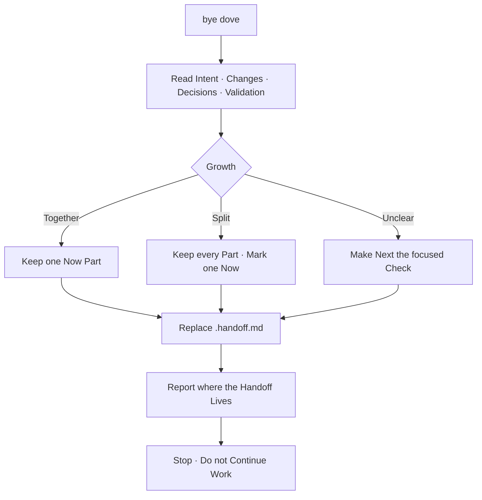

# ByeByeBye

A Session Closing, not a Summary for Display.
It Leaves the next Session one durable Thread to Pick up.

The Opening lives in [YoYoYo](../yo-yo-yo/SKILL.md).
The canon lives in [Change Growth](../../../rules/change-growth.md).



## When it Runs

Invoke when the User Says `bye dove`, Asks to Stop,
or Requests a Handoff for the next Session.

## Evidence

Read only the current Thread and current Repository State:

1. **Intent** — the Ask that still Explains the Work.
2. **Changes** — staged, unstaged and untracked Paths.
3. **Decisions** — Choices that the next Session must Preserve.
4. **Validation** — Checks already Run and their Result.
5. **Growth** — whether the Work is `Together`, `Split` or `Unclear`.

Do not Reconstruct old History unless the current Thread Refers to it.
Do not Review the Code or Invent Work that was not Discussed.

## Write the Handoff

Write `.handoff.md` at the Repository Root.
Replace its Content when it already Exists;
one Repository Holds one active Handoff.

Use this Shape:

```markdown
# Handoff

**Intent** — the one Outcome being Pursued.

**Done** — durable Work already Completed.

**Open** — the unresolved Decision, Edit or Validation.

**Growth** — Together, Split or Unclear.

**Now** — the one Part to Resume first.

**Later** — deferred Parts, or None.

**Paths**
- path — why it Matters.

**Validation** — Command and Result, or Not Run.

**Next** — one concrete Action.
```

Keep Claims factual and Paths repository-relative.
Mark uncertain Claims as `Inferred`.
Never Store Secrets, Tokens, terminal History or full Conversation Text.

When Growth is `Split`, Preserve every Part
but Mark exactly one as `Now`.
When Growth is `Unclear`, make `Next` the focused Check
that can Separate the Intents.

## What it Returns

After Writing, Say only what was Left and where:

```text
✅ Handoff Written to .handoff.md
Next Session Starts with: one concrete Action.
```

## Bounds

- Never Commit or Push the Handoff.
- Never Stage Files.
- Never Continue Implementation after Writing it.
- Never Hide Failed or missing Validation.
- Never Include unrelated dirty Paths.
- Never Leave two Parts marked `Now`.
