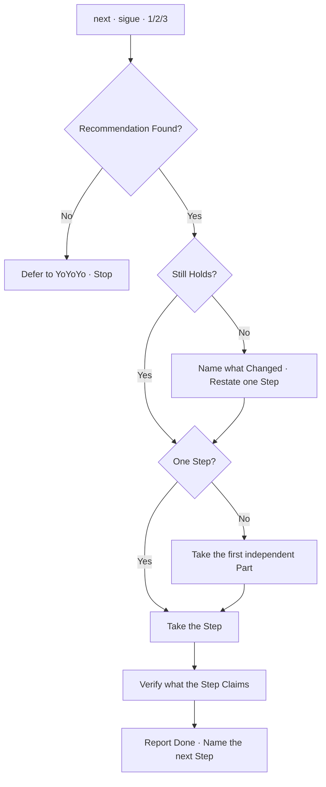

# NextNextNext

A continuation, not a plan and not a session Opening.
It Takes the step that was already named,
does it once,
and names the one that follows.

The next turn Lives in [ByeByeBye](../bye-bye-bye/SKILL.md).
The canon Lives in [Change Growth](../../../rules/change-growth.md).
The shape Lives in [The Lever and the Tape](../../../patterns/the-lever-and-the-tape.md).



## When it Runs

Invoke when the user says `next`, `sigue`, `continue` or `go on`,
replies with the number of a presented choice,
or asks what to do now and wants it Done, not listed.

Do not invoke to open a Session; YoYoYo reconstructs state.
Do not invoke to close one; ByeByeBye writes the Handoff.
Do not invoke for a new Ask that carries its own intent.

## Find the Recommendation

Read the smallest Source that already names a next step:

1. **Selected Choice** — the user's latest number,
   resolved against the numbered choices immediately before it.
2. **This Thread** — the last explicit `Next` line Stated here.
3. **Handoff** — the explicit `Next` in `.handoff.md`, when present.
4. **Plan** — the next unchecked Step in an approved Plan.

The selected choice Wins over a standing `Next`.
The thread Wins over the handoff when both speak.
`Now` names the current Scope. `Later` preserves context.
Neither is a Recommendation.
When no source names a step, do not Invent one.
Say so, and defer to YoYoYo.

## Confirm it Holds

A named step can Expire before it runs.
Check three Things:

1. Does the repository still Look the way the step assumed?
2. Did the user Change the intent since the step was named?
3. Was the Step already done by a later turn or another session?

When it holds, Take it.
When it does not, name what Changed in one line,
restate one Step, and take that one.
Never take a Step the evidence already contradicts.

## Take one Step

One step is one Outcome that can be verified alone.
When the recommendation Carries more than one outcome,
take the first independently verifiable Part
and leave the rest as `Later`.

Do the Work. Do not narrate the options.
Do not start a second Part because the first was small.
When the step crosses a Boundary the user has not authorized —
a push, a deletion, an outward send —
stop before it and Ask.

## Verify

Verify what the step Claims, and nothing wider:

- a file Change, by reading the result or running its check;
- a Command, by its exit and its output;
- a rule Edit, by the link and the frontmatter it names.

When verification Fails, report the failure and stop.
A failed step is the next Step.

## What it Returns

```text
✅ **Done** — Linked the reading Rotation into the rules index.

**Verified** — the path Resolves; the frontmatter parses.
**Next** — Reload the skills in the local client.
**Later** *(context only)* — Translate the rotation labels.
```

When nothing Holds:

```text
⚠️ No standing Recommendation found.
Open the Session with YoYoYo, or name the step.
```

## Bounds

- Never take a Step no source named.
- Never execute `Now` or `Later` as the standing Recommendation.
- Never infer a numbered choice from anything but the user's reply.
- Never take two Steps in one invocation.
- Never replace a session Opening or a session closing.
- Never Write, rewrite or delete `.handoff.md` here.
- Never Push, delete or send without explicit authority.
- Never report a Step done that verification did not confirm.
- Never silently redefine the Step the user was waiting on.
