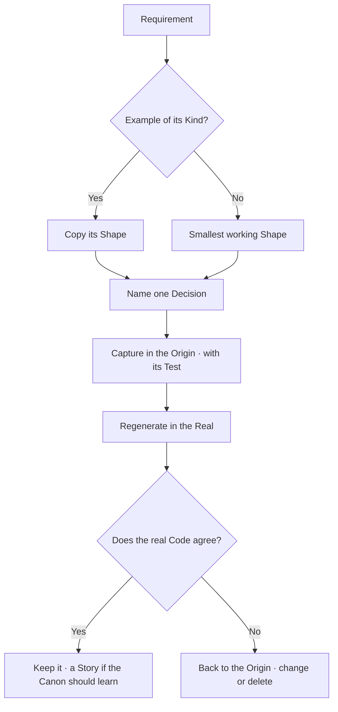

# Design Workflow

A Shape-giver, not a style-checker.
It decides how little Architecture a requirement needs,
and keeps the Example and the real Code telling the same Story.

The Values Live in [Approaches](../../../../values/approaches.md):
Convention over Configuration, Simplicity over Coverage,
and a Working Example beats the Generic one.
The Evidence Lives in [Show me the Code](../../../../patterns/show-me-the-code.md).

## Boundary

This workflow Runs before implementation when a requirement Moves the Shape.
The parent [OneTwoRefactor](../SKILL.md) applies code Rules while writing.
It is not a Code Review, and it never invents a Generic Framework.

## When it Runs

- A requirement Adds, Splits or Removes a responsibility.
- A new project Starts, and its Kind has an Example.
- Real code Taught something the Examples do not Hold yet.
- The user Asks how simple an Architecture can stay.

Do not Run it for a bug fix or a rename inside one Shape.

## The Kinds

An Example Exists per Kind, and one Example is not Universal.
Copy the Structure of the Example of its Kind, not its Business.

| Kind | Origin Example | Real Example |
| --- | --- | --- |
| API | [examples/school](../../../../examples/school) | muchi-api, beside this repository |
| Converter | [examples/pdf](../../../../examples/pdf) | none yet |

A Kind with no row is a new Kind: build the smallest working Shape first,
and let the Next project decide what is Generic.
Read the paired repository's own `MEMORY.md` before citing a path in it.

## Design from the Requirement



1. **Entities** — name the Things and the Interactions the requirement Holds.
   Three is a Source to derive from, never a quota.
2. **Kind** — find the Example of its Kind; copy its Structure.
3. **Smallest Shape** — start with one package and one Door.
   A seam Earns its place by a named Rule:
   a vendor Behind [Layers](../../../../rules/layers.md) and
   [Providers](../../../../rules/providers.md),
   a boundary Crossing in [Shapes](../../../../rules/shapes.md),
   a controlled Answer in [Failures](../../../../rules/failures.md).
   A seam with no Reason is a Layer nobody can Delete.
4. **Three Questions** — who Reads it, who Runs it, who Deletes it.
   A Unit that cannot be Deleted alone is not a Unit.
5. **One Decision** — name it with its Reason and its Cost.
   A Case that costs more than it Serves goes Unsupported: say so, and Stop.

## The Loop

A decision may be Born in either place. Run the Loop from where it Was.
The Origin Holds it Clean, free of Business noise;
the Real Holds the Proof that it Survives.

1. **Capture** — land the Decision in the Origin Example,
   with the Test that Holds it and the Spec unchanged where it can be.
   A Rule that Lands in code Lands with its Test.
2. **Regenerate** — apply the same Decision in the Real project,
   in that repository's own thread and its own commit.
3. **Compare** — run the Real code.
   Agreement Keeps the Decision.
   Disagreement Sends it back: the Origin changes or the Decision is deleted.
   Real code Wins a Disagreement, because there is no better Example.
4. **Teach** — when the Canon should Learn from it, write a Story.
   A real Codebase Feeds; it does not Govern.
   The Story Climbs only if a second project Agrees.

## What it Returns

Keep it to the Shape and its Decisions, never a Review.

```text
**Requirement** — A Course Holds at most thirty Students.
**Kind** — API; copy `examples/school`.

**Shape** — one Core check and one Fault; no new Layer.
**Decision** — the limit Lives beside the Course, Cost: one more Column.

**Origin** — capture in `examples/school/go/school`, with its Test.
**Real** — regenerate in muchi-api afterwards, in its own thread.

**Next** — write the Origin Test first.
```

## Bounds

- Always generate from zero when it is possible.
  Patch only when generation is not, and say why.
  A Spec proves itself sufficient only by Producing the Code again.
- Never add a Layer, a Provider or an Option without a named Reason.
- Never design a Generic Framework before a second Example demands it.
- Never regenerate in two repositories in one thread.
  Name the other repository's Step and hand it over.
- Never let the Origin Win a Disagreement with real running Code.
- Never copy a Path that [.canonignore](../../../../.canonignore) lists.
- Never present a Decision without its Cost.
- Never commit; [commit-commit-commit](../../commit-commit-commit/SKILL.md) does that.
