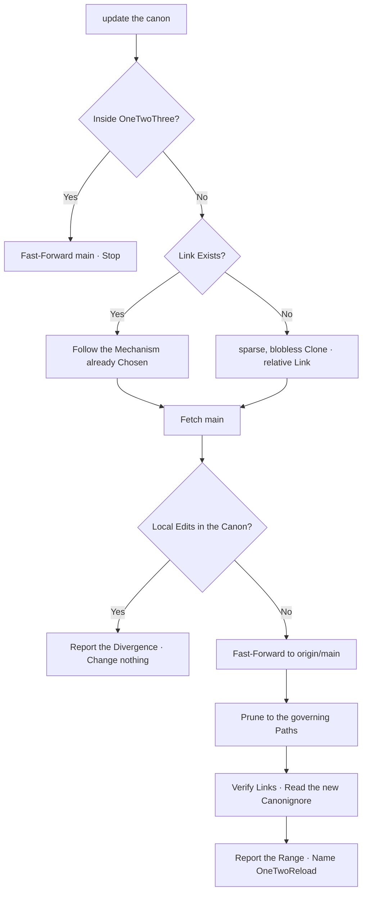

# OneTwoUpdate

A Fetcher of the Canon, not a Copier of it.
It Brings `main` from the remote OneTwoThree,
Keeps only what Governs, Loads only the Index,
and Leaves every local File the Project Owns untouched.

The canon lives in [The Head is the Canon](../../../rules/the-head-is-the-canon.md),
[Vendor Integration](../../../rules/vendor-integration.md)
and [Canonignore](../../../rules/canonignore.md).
The Loading lives in [OneTwoReload](../one-two-reload/SKILL.md).

The Source is one Address:

```text
https://github.com/cangrejometralleta/OneTwoThree.git   branch: main
```



## When it Runs

Invoke when the User Asks to Update, Sync or Pull the Manifesto,
when a Project first Adopts OneTwoThree,
or when a Rule Read here Disagrees with the Rule Named upstream.

Do not Invoke to Load Skills into a Client; OneTwoReload Does that.
Do not Invoke to Open a Session; YoYoYo Pulls the Project's own Branch.

## Two Reductions, not one

`Memory` and `Context` are Cut by different Means.
Do both, and never Confuse one Report for the other.

**Memory** is what Lands on Disk. Check out only the governing Paths:

```text
AGENTS.md  RULES.md  VALUES.md  PATTERNS.md  .canonignore
rules/     values/   patterns/
```

**Context** is what Enters the Prompt. Load only the Index:

```text
AGENTS.md  RULES.md  VALUES.md  PATTERNS.md
```

The Index Names every Rule with one Line and one Link.
A Body is Read the Turn its Rule is Invoked, and not before.
Three Indexes Cost about 7 KB; their Bodies Cost about 50 KB;
the whole Repository Costs about 2.4 MB.

Never Preload `rules/`, `values/` or `patterns/` wholesale.
The Index Exists so an Agent can Know a Rule is there
without Paying to Read it.

## Inside the Canon Repository

First Ask whether the current Repository *is* OneTwoThree.
Compare the Origin Address, not the Directory Name.

When it Is, there is nothing to Vendor or Reduce.
Fast-Forward `main` from `origin`, Report the Range, and Stop.
Never Vendor the Canon into the Repository that Writes it.

## What it Reads

Read only what Names the Connection:

1. **Origin** — the current Repository's Remotes.
2. **Link** — an existing Submodule, Subtree, Clone or symbolic Link
   that already Points at OneTwoThree.
3. **State** — whether that Link Carries local Commits or dirty Paths.
4. **Canonignore** — the incoming `.canonignore`, Read after the Fetch.

`AGENTS.md` or local Documentation may Name a different Entrance.
Follow what the Project Documents over what this Skill Assumes.

## Follow the Mechanism already Chosen

A Project that already Tracks the Canon has Answered this Question.
Detect which Answer it Gave, and Use it:

| What you Find | What you Run |
| --- | --- |
| A Submodule pointing at OneTwoThree | `git submodule update --remote` |
| A Subtree | `git subtree pull --prefix <path> <url> main --squash` |
| A Clone under a Cache or Vendor Path | `git fetch origin main` then Fast-Forward |
| A symbolic Link to a Clone elsewhere | Update the Clone the Link Resolves to |
| Nothing | Adopt, below |

Re-apply the Path Reduction after a Fetch that Widens it.
Never Convert one Mechanism into another to Make the Update easier.
A Project Changes how it Tracks the Canon on Purpose, never as a Side Effect.

## Adopt, when Nothing Exists

Choose the smallest Thing that Keeps one Source:

```sh
git clone --filter=blob:none --sparse --branch main \
  https://github.com/cangrejometralleta/OneTwoThree.git <vendor-path>
git -C <vendor-path> sparse-checkout set \
  AGENTS.md RULES.md VALUES.md PATTERNS.md .canonignore rules values patterns
```

`--filter=blob:none` Leaves the History on the Server until it is Asked for.
`--sparse` Leaves the ungoverned Paths off the Disk entirely.

Then Point the Project at it with a relative symbolic Link,
and Name the Path and the Link in `AGENTS.md`.

Ask before the first Adoption. It Adds a Dependency,
and a Dependency Added Silently is a Dependency nobody Chose.

## Never Overwrite what the Project Wrote

Fast-Forward only.

When the local Canon Carries Commits that `origin/main` does not,
Stop and Report the Divergence. Those Commits are either
a Fork worth Keeping or an Edit that Belonged upstream,
and only the User can Say which.

- Never Force Push, Force Pull, Reset hard or Discard local Commits.
- Never Merge or Rebase the Canon into the Project's own History.
- Never Edit a File under the vendored Canon to Resolve a Conflict.

## Read the new Canonignore

The Canon Arrives with its own Boundary; Read it after every Fetch.
Paths it Lists are Carried and not Taught — `jokes/`, `stories/`,
`STORY.md`, `chaos/` among them.

The Reduction already Keeps them off the Disk,
so a Path that Appears despite it is a Signal, not a Convenience:
the Boundary Moved upstream, and the sparse Set has to Move with it.

Read them freely where they Exist. Copy none of them into the Project.
An Update that Teaches from an ignored Path Made the Canon worse,
not fresher.

## Verification

1. The fetched Ref is `main` from the OneTwoThree Address, not a Fork.
2. The Link Resolves from the Project Root.
3. `RULES.md`, `VALUES.md` and `PATTERNS.md` Exist at the linked Root.
4. Every Link inside those three Indexes Resolves to a checked-out Body.
5. No Path outside the governing Set Landed on Disk.
6. The Range between the old and new Commit is Nameable.

A Fetch that Moved no Ref is `Already Current`, not `Updated`.
An Index Link that Resolves to nothing means the sparse Set is too narrow.

## What it Returns

```text
✅ Canon Updated — 63a3010..f3bdfa6 (4 Commits)

**Source** — cangrejometralleta/OneTwoThree, main.
**Entrance** — vendor/onetwothree, linked from .agents/canon.
**Changed** — 2 Rules, 1 Pattern.
**Reduced** — 58 KB on Disk, 7 KB Loaded.

**Next** — Reload the Client with OneTwoReload.
```

When the Ref did not Move:

```text
✅ Already Current — main at f3bdfa6.
```

When the local Canon Diverged:

```text
❌ Canon Diverged — 2 local Commits not on origin/main.
Nothing Changed. Name whether they are a Fork or an Edit to Send upstream.
```

## Bounds

- Never Copy a canonical File into the Project by Hand.
- Never Vendor the Canon into OneTwoThree itself.
- Never Fetch from a Fork while Claiming the Canon.
- Never Adopt a new Dependency without Asking.
- Never Fast-Forward past local Commits, and never Discard them.
- Never Preload a Body the Index can Name for free.
- Never Widen the sparse Set to Make one Read easier; Read it on Demand.
- Never Teach from a Path `.canonignore` Lists.
- Never Report `Updated` when no Ref Moved.
- Never Claim the Client Sees the new Canon; OneTwoReload Proves that.
