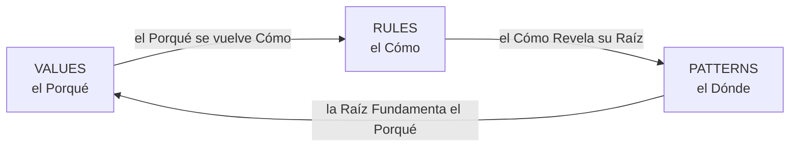
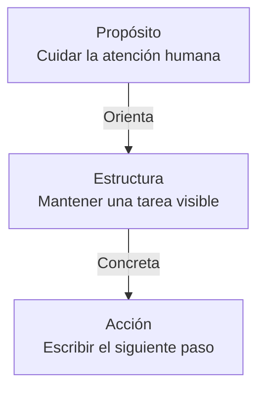
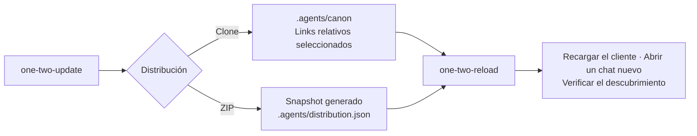
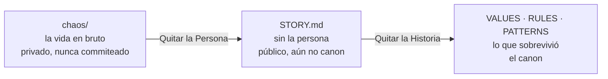

# OneTwoThree

[English](README.md)

OneTwoThree es un Repositorio que es a la vez un Manifiesto y una Base de código.
Sus Reglas dicen cómo un Agente debe leer, escribir y colaborar aquí.
Sus Valores y Patrones guardan las razones, para que una Persona pueda cuestionarlas.

Esta Página es la versión técnica de la [Presentación](docs/presentation.es.md).
La Presentación cuenta el porqué; esta Página dice dónde vive cada pieza y cómo comprobarla.
Los documentos enlazados están en inglés, salvo la Presentación.

## El Repositorio, en un Mapa

```text
VALUES.md   el Porqué      creencias, en values/
RULES.md    el Cómo        reglas verificables, en rules/
PATTERNS.md el Dónde       raíces que se repiten, en patterns/
AGENTS.md   el Puntero     lo que un agente carga solo
.agents/    agents/ y skills/, las operaciones
examples/   school/ y pdf/, las reglas corriendo en Go
docs/       la Presentación, en inglés y en español
stories/    STORY.md, stories/ y chaos/: contexto, aún no canon
jokes/      humor escrito a mano; se lee, nunca se agrega
```

Tres Documentos sostienen el Manifiesto, y esta Página los indexa:
[Values](VALUES.md), [Rules](RULES.md) y [Patterns](PATTERNS.md).
Un Agente parte en [AGENTS.md](AGENTS.md) y lee primero [Rules](RULES.md).

## El Head es el Canon

El Canon es el head de `main`, y nada más.
No hay tag, ni release, ni versión: una Regla leída desde un commit antiguo es un Fork.
[The Head is the Canon](rules/the-head-is-the-canon.md) explica por qué.

[.canonignore](.canonignore) lista los Paths que el Canon lleva pero no gobierna.
Usa la sintaxis de `.gitignore`, y git lo lee directamente:

```sh
git ls-files --cached --ignored --exclude-from=.canonignore   # versionado, no gobernado
git ls-files --others --ignored --exclude-from=.canonignore   # solo en disco
```

Un Agente puede leer cada path de la lista, pero nunca copiar uno.

## Por qué Tres

El Tres sale de una cuenta, no de un gusto.
Con `n` entidades hay `n(n-1)/2` interacciones posibles, y la comprensión vive en las interacciones.

| Entidades | Interacciones | Lectura |
| --- | --- | --- |
| 1 | 0 | Atención, nada que relacionar |
| 2 | 1 | Una relación, y un extremo se vuelve centro |
| 3 | 3 | Cada par visible, y el ciclo se cierra |
| 4 | 6 | Más relaciones que cosas |
| 5 | 10 | Las relaciones dejan de ser contables |

Tres es el último conteo donde ambas columnas coinciden, y el menor que cierra un ciclo.
El Número es una Fuente de la que derivar, nunca una cuota que alcanzar.
Una situación con cuatro categorías se queda con las cuatro.
Ver [Three over Four](patterns/three-over-four.md) y [Count me In](patterns/count-me-in.md).

## Valores, Reglas y Patrones Rotan

[RoTaTion](patterns/de-la-soul-rotation.md) conecta los tres Documentos mediante tres pares, sin centro fijo.
Se entra por cualquier Elemento y se siguen las relaciones.



Una Regla debe poder ejecutarla un Agente, o es un Valor.
Las Reglas son verificables y los Valores son interpretables.
Una Regla marcada *Provisional* salió de una sola práctica, y se borra si el siguiente proyecto la contradice.

Una segunda lectura va del Propósito a la Acción en tres Capas:



## DeLaCase es un Presupuesto que se puede Contar

[DeLaCase](rules/de-la-case.md) es la Convención tipográfica para la prosa.
Una mayúscula marca una Entidad o una Interacción digna de notarse.

1. Divide el texto en pasajes según la puntuación; una viñeta o un salto de línea duro también cierra uno.
2. Gasta como máximo tres mayúsculas de énfasis por pasaje.
3. La inicial gramatical es gratis; los nombres propios y las siglas conservan su ortografía.

> La Persona Guía a la Máquina, la Máquina Apoya a la Persona.

Dos pasajes, cada uno con su propio presupuesto, cada uno gastando tres.
Tres es un techo, nunca una cuota.

El código tiene su propia regla: la capitalización de un identificador pertenece al lenguaje, y el lenguaje decide.
En Go, una mayúscula cruza la frontera del paquete y el compilador lo hace cumplir.
El texto final en una interfaz de usuario usa capitalización ordinaria.

La negrita es un segundo nivel y cuesta más: una por sección, o ninguna.
[Channels](rules/channels.md) cuenta lo que una superficie puede cargar, y [Emoji](rules/emoji.md) marca un estado, uno por línea como máximo.

## Las Reglas para el Código

Cada regla que gobierna código corre en [examples](examples).
[Show me the Code](patterns/show-me-the-code.md) explica por qué importa.

| Regla | Afirmación que se puede comprobar |
| --- | --- |
| [Layers](rules/layers.md) | El Core no nombra ningún vendor ni socket; el compilador sostiene la frontera. |
| [Providers](rules/providers.md) | El Core declara una interfaz; un Port se nombra por la necesidad, nunca por el vendor. |
| [Shapes](rules/shapes.md) | La entidad nunca es el DTO: Wire, Business y Storage son tres tipos. |
| [Failures](rules/failures.md) | Un fallo controlado lleva su respuesta; una sola función lo mapea a un status. |
| [Constants](rules/constants.md) | Las constantes globales van separadas de la configuración y se validan al arrancar. |
| [Scripts](rules/scripts.md) | Todo programa responde `build.sh` y `run.sh`, y cada uno rechaza lo que fallaría. |
| [Entrypoints](rules/entrypoints.md) | Las puertas se declaran en una lista; un shim solo llama a la lógica. |
| [Tests](rules/tests.md) | La expectativa se escribe explícita, y luego se prueba por mutación. |
| [Naming](rules/naming.md) | Verbo + Sustantivo + contexto, tres palabras como máximo. |
| [Structure](rules/structure.md) | Tres tiempos por función, no tres saltos de línea. |

### El Servicio School

[School](examples/school/README.md) es una API escrita en Go, Java y TypeScript.
La misma [Especificación](examples/school/SPEC.md) vale para las tres, y [The Before](examples/school/BEFORE.md) muestra el original con cada regla rota nombrada.

```text
main       arma los actores y elige un adaptador
adapters   los únicos archivos que importan un framework
api        el guion: handlers y los providers que declaran
app        el cruce, la forma y el caller
school     el núcleo de negocio: sin HTTP, sin driver
store      el único paquete que importa un ORM
wire       el contrato, cada forma que un cliente envía o recibe
faults     fallos controlados, cada uno con su respuesta
settings   el cargador JSON estricto, validado al arrancar
```

```sh
cd examples/school/go
go list -deps ./school             # no lista ningún vendor ni net/http
./build.sh                         # gofmt, vet, test, luego el binario
TOKEN_SECRET=s ./run.sh gin        # stdlib, chi o gin
```

Un handler responde con un valor o falla, y nunca arma una respuesta:

```go
func (a SchoolAPI) ShowStudentRecord(req transport.Request) (any, error) {
	id, err := app.ReadPathNumber(req)
	if err != nil {
		return nil, err
	}

	student, err := a.Students.SelectStudentRow(school.StudentID(id))
	if err != nil {
		return nil, err
	}

	return school.RenderStudentView(student), nil
}
```

Once líneas, tres tiempos: recibir, transformar y devolver.

### El Conversor PDF

[PDF](examples/pdf/README.md) renderiza el manifiesto de Markdown a PDF en Go puro.
`markdown/` es el único paquete que importa goldmark, y `render/` el único que importa gopdf.
`document/` y `style/` no importan ningún vendor, y cinco funciones pequeñas convierten Markdown simple en un librito.

```sh
cd examples/pdf
./build.sh
./run.sh testdata/sample.md        # escribe sample.pdf al lado
```

## Dove, el Agente

[Dove](.agents/agents/dove.md) lee una explicación a través del manifiesto, nombra el Patrón y da un paso acotado.
Es un intérprete, nunca un revisor: no devuelve hallazgos ni ordena nada por severidad.

| Pieza | Dónde |
| --- | --- |
| Definición, la fuente única | [.agents/agents/dove.md](.agents/agents/dove.md) |
| Shim para clientes que leen TOML | [.agents/agents/dove.toml](.agents/agents/dove.toml), que solo manda al agente a leer el Markdown |
| Herramientas | `Bash`, `Read`, `Grep`, `Glob`, `Edit`, `Write` |
| Identificador | `dove` en paths y configs, Dove en prosa |

El Flujo es un filtro: cada paso quita lo que el siguiente no necesita.

1. **Escuchar** lee solo lo que el pedido nombra, y no pregunta nada que pueda leer.
2. **Ver** cuenta la Forma que se repite: una vez es un detalle, dos un hábito, tres un Patrón.
3. **Esbozar** señala exactamente dos lugares por desenredar, cada uno con su costo.
4. **Tirar** toma el primer hilo, nombra el paso anterior y el siguiente, y se detiene.

Cada Turno es un cordel con tres nudos: **Tema**, **Perspectiva** y **Remate**.
Un pedido con tres hilos recibe uno tirado y dos nombrados, nunca tres tomados.

Sus Límites son explícitos:

- Edita solo lo que el turno nombró, un paso por turno.
- Nunca revisa, nunca reescribe un archivo completo en la respuesta, nunca normaliza las mayúsculas que recibió.
- Lee [.canonignore](.canonignore) antes de citar un path.
- Tras tres turnos de escritura o tres archivos tocados, considera [one-two-growth](.agents/skills/one-two-growth/SKILL.md).

También engancha el ciclo de la sesión: una edición durable llama a `one-two-checkpoint`, `hey dove` llama a `hey-hey-hey` y `bye dove` llama a `bye-bye-bye`.
El Quipu detrás de la forma del turno se cuenta en la [Presentación](docs/presentation.es.md).

## Las Skills

Las Skills definen las operaciones; cada archivo enlazado guarda los detalles.

| Cuándo | Skill | Qué hace |
| --- | --- | --- |
| `hey dove` o retomar trabajo previo | [hey-hey-hey](.agents/skills/hey-hey-hey/SKILL.md) | Sincroniza la rama, reconstruye el contexto y nombra un siguiente paso. |
| `next`, `sigue` u opción elegida | [next-next-next](.agents/skills/next-next-next/SKILL.md) | Da un paso recomendado, lo verifica y nombra el siguiente. |
| Una edición, decisión o validación durable | [one-two-checkpoint](.agents/skills/one-two-checkpoint/SKILL.md) | Guarda el hilo en `.handoff.md` durante el trabajo. |
| Un cambio empieza a crecer | [one-two-growth](.agents/skills/one-two-growth/SKILL.md) | Revisa si una sola intención aún sostiene el cambio. |
| Pedir las stories pendientes | [one-two-stories](.agents/skills/one-two-stories/SKILL.md) | Ordena las stories por lo que esperan y destila la que elijas. |
| Pedir organizar, commitear y pushear | [commit-commit-commit](.agents/skills/commit-commit-commit/SKILL.md) | Agrupa cambios por feature, commitea cada grupo y pushea una vez al final. |
| `bye dove` o pedir un handoff | [bye-bye-bye](.agents/skills/bye-bye-bye/SKILL.md) | Expande el checkpoint en un handoff de cierre y se detiene. |
| Un secreto pudo entrar al historial | [one-two-purge](.agents/skills/one-two-purge/SKILL.md) | Detecta, confirma y purga un valor exacto de archivos e historial; también quita la autoría como último recurso. |

Las skills de apoyo dan forma al trabajo mientras ocurre:
[one-two-refactor](.agents/skills/one-two-refactor/SKILL.md) para código,
[de-la-case](.agents/skills/de-la-case/SKILL.md) para nombres y prosa,
[one-two-output](.agents/skills/one-two-output/SKILL.md) para la salida de terminal y
[one-two-joke](.agents/skills/one-two-joke/SKILL.md) para leer el directorio de chistes.

El [Diagrama de Sesión](patterns/the-lever-and-the-tape.md) conecta estas operaciones.
Un pedido nuevo con su propia intención inicia su propio trabajo.
Abrir una sesión nombra el siguiente paso; publicar y cerrar necesitan cada uno su propio pedido.

## Conectar un Proyecto

[one-two-update](.agents/skills/one-two-update/SKILL.md) instala o actualiza la conexión con el canon.
[one-two-reload](.agents/skills/one-two-reload/SKILL.md) conecta el cliente activo con las skills y agentes elegidos.



Las instalaciones existentes conservan su mecanismo y sus personalizaciones locales.
Un [ZIP portable](.agents/skills/one-two-update/references/zip.md) registra su commit de origen y el inventario de archivos.
Es un snapshot; el canon vivo sigue siendo el head de `main`.
La validación del filesystem prueba los links, y el descubrimiento del cliente prueba la carga.

## Cómo el Contexto se vuelve Canon

Tres Etapas llevan un pedazo de vida al canon, y solo la tercera se queda.



- Una creencia va a Values, una regla que un agente puede correr va a Rules, una raíz va a Patterns.
- Una story espera evidencia, trabajo aún en movimiento o una decisión: BLOCKED.
- Nueve Stories llenan el pasaje; se destila una antes de promover una décima.
- `chaos/` tiene su propio `.gitignore`, y solo su ejemplo se publica.
- En un proyecto de código, una decisión aterriza en `docs/`, una regla en código sostenido por un test, una promesa en el contrato de la API.

Un Stories vacío significa que el canon está al día.
[one-two-stories](.agents/skills/one-two-stories/SKILL.md) las ordena, una por turno.

## Los Agentes Trabajan entre Otros

Un Agente necesita una Sociedad: autoridad explícita, señales independientes, el derecho a detenerse y un humano a quien escalar.
[Coercion](rules/coercion.md) guarda las reglas: nunca inventar permiso, nunca tomar represalias, nunca dejar que la presión haga parecer necesario un daño.

## Verificar

| Chequeo | Comando |
| --- | --- |
| Pares de traducción intactos | el loop de [Translations](rules/translations.md) no imprime nada |
| Paths que el canon no gobierna | `git ls-files --others --ignored --exclude-from=.canonignore` |
| El Core no importa vendors | `go list -deps ./school` en `examples/school/go` |
| Los ejemplos compilan y pasan | `./build.sh` en cada directorio de ejemplo |

## El Nombre

OneTwoThree toma su nombre de *The Magic Number*, de De La Soul.
Un solo Nombre, cualquier escritura: OneTwoThree y one-two-three son el mismo Proyecto.
El resto de la historia vive en la [Presentación](docs/presentation.es.md).

## Licencia

[MIT](LICENSE). Código y texto por igual — úsalo, adáptalo, compártelo, solo mantén el aviso de copyright.
