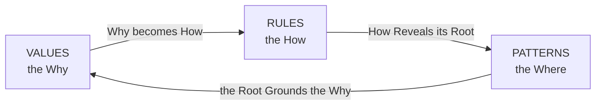
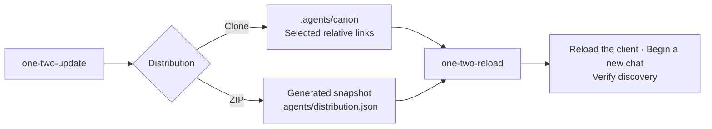
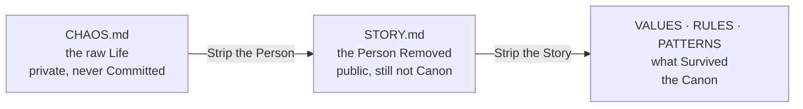

# OneTwoThree

> Because we Hate making documentation.
> 
> The Limit behind all of this was lived before it was written.
> Autistic burnout Taught it, minimalism only named it.
> 
> Thanks De La Soul, Grandma COBOL and John Cage
> for inspiring this Project.

## License

This is free and unencumbered software
released into the public domain.
Do whatever you want with it.
[The Unlicense](https://unlicense.org)

## Documents

Three documents Hold the manifesto.  
This page is the Door that indexes them.

- [Values](VALUES.md) — why it Exists.
- [Rules](RULES.md) — how it Applies.
- [Patterns](PATTERNS.md) — where the Why comes from.

Why / How / Where:  
the triad Lives in the structure itself.

Three elements, three pairs, no Center.
Remove the Center and the shape still turns.

## How to Read it

- Read it as a Manifesto,  
  or import it as context for an agent.
- Use up to two emphasis Capitals per sentence, beyond its free Initial.
  The main emphasis Follows the voice; the second marks a useful Relationship.
  Proper names and acronyms Keep their established Spelling.
  [OneTwoCase](rules/one-two-case.md) Holds the convention; two is a Ceiling, never a quota.
- Every Line is written  
  to be read in one heartbeat.
- Three is a Source, not a count.  
  You Derive from Three,  
  you do not reach it.

## Work with Dove and the Skills

[Dove](.agents/agents/dove.md) Holds the voice.
The skills Define the operations; their linked instructions hold the details.

| When | Skill | What it does |
| --- | --- | --- |
| `yo dove` or resume earlier work | [yo-yo-yo](.agents/skills/yo-yo-yo/SKILL.md) | Synchronizes the project branch, reconstructs context and names one next Step. |
| `next`, `sigue` or a selected option | [next-next-next](.agents/skills/next-next-next/SKILL.md) | Takes one recommended step, verifies it and names the Following step. |
| A durable edit, decision or validation | [one-two-checkpoint](.agents/skills/one-two-checkpoint/SKILL.md) | Saves the current thread in `.handoff.md` during Work. |
| A change starts growing | [one-two-growth](.agents/skills/one-two-growth/SKILL.md) | Checks whether one intent still Holds the change. |
| Ask to organize, commit and push | [commit-commit-commit](.agents/skills/commit-commit-commit/SKILL.md) | Groups changes by feature, validates and commits each group, then Pushes once after all succeed. |
| `bye dove` or request a handoff | [bye-bye-bye](.agents/skills/bye-bye-bye/SKILL.md) | Expands the checkpoint into a closing handoff and Stops. |

The [session diagram](patterns/the-lever-and-the-tape.md) Connects these operations.
A new request with its own intent Starts its own work.
Opening a session Names the next step; continuation takes it when requested.
Publication and closing each Need their own request.

Supporting skills Shape the work as it happens:
[one-two-refactor](.agents/skills/one-two-refactor/SKILL.md) guides code,
[one-two-case](.agents/skills/one-two-case/SKILL.md) converts names and prose,
and [one-two-output](.agents/skills/one-two-output/SKILL.md) shapes terminal output.
The typography convention is [OneTwoCase](rules/one-two-case.md).
The commit workflow is `commit-commit-commit`.

## Connect a Project

[one-two-update](.agents/skills/one-two-update/SKILL.md) Installs or updates the canon connection.
[one-two-reload](.agents/skills/one-two-reload/SKILL.md) Connects the active client to the selected skills and agents.
Session opening Synchronizes the project's branch; canon updates follow their own connection.

Existing installations Keep their chosen mechanism and local customizations.
A [portable ZIP](.agents/skills/one-two-update/references/zip.md) Records its source commit and file inventory.
It is a Snapshot; the live canon remains the head of `main`.
Filesystem validation Proves the links; client discovery proves the load.

## Agents Work among Others

An agent Needs more than a goal.
It needs a Society: explicit authority, independent signals,
the right to stop and a human it can escalate to.

Recent security research shows why those boundaries must be Designed,
not assumed. [Coercion](rules/coercion.md) Carries the rules:
never invent Permission, never retaliate,
and never let pressure make harm look necessary.

## How Context Becomes Canon

Three stages Carry a piece of life into the canon,
and only the third one stays.

- **CHAOS.md** Holds the raw life.
  Private, never Committed,
  names and dates still in it.
- **Stories** Holds the same piece
  with the person removed.
  Public, Staged, still not canon.
- **Values, Rules and Patterns** hold what Survived.

Between the first and the second you Strip the person.
Between the second and the third you Strip the story.
What is left is the Belief, the Rule or the Root.

- A belief Goes to Values.
- A rule an agent can run Goes to Rules.
- A root Goes to Patterns.
- Delete it from Stories once it lands.

CHAOS.md never Empties, because a source never empties.
Stories Empties, because a passage is meant to.
Nine entries Fill the passage.
Distill before you promote a Tenth.

.gitignore Names CHAOS.md out loud.
Patterns Explains why,
under The Right you have to Invoke.

An empty Stories means the canon is Current.

The name Comes from Patterns, under Chaos is a Source.

AGENTS.md is not this Passage.
It is the short Pointer agents load on their own —
canon first, Stories named as notes, nothing undistilled repeated there.

## Jokes

[Jokes](jokes) is not a Stage of that passage.
It Runs beside it, and it never arrives.

A human Writes them by hand, to tune the humour of the language.
The Rules Teach an agent to count beats; none of them teaches timing.
An agent Reads the directory to hear the voice,
and it never adds a line to it.

Each joke Stays in the language it was born in, Spanish or English.
Most of them are Grammatical, and a translated pun is a sentence about a pun.

No one Explains a joke there, least of all an agent.
Explaining Kills it, and there is no careful way to do it.

[.canonignore](.canonignore) Says the same thing to a machine.
