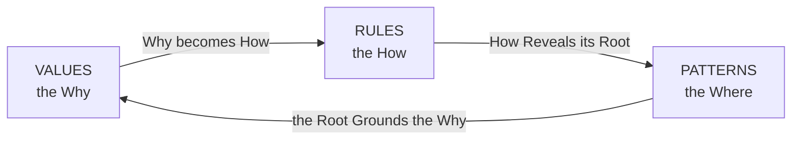
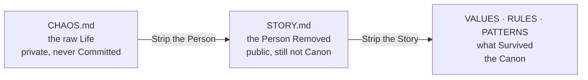

# OneTwoThree
>
> Version: 0.1.0
>
> Because we Hate making Documentation.
>
> The Limit behind all of this was Lived before it was Written.
> Autistic Burnout Taught it, Minimalism only Named it.
>
> Thanks De La Soul, Grandma COBOL and John Cage
> for Inspiring this Project.
>
> And Damon Albarn, who Closed the Circle:
> Feel Good Inc Carries De La Soul inside it.

## License

This is free and unencumbered software
released into the public domain.
Do whatever you want with it.
[The Unlicense](https://unlicense.org)

## Documents

Three Documents Hold the Manifesto.  
This Page is the Door that Indexes them.

- [Values](VALUES.md) — Why it Exists.
- [Rules](RULES.md) — How it Applies.
- [Patterns](PATTERNS.md) — Where the Why Comes from.

Why / How / Where:  
the Triad Lives in the Structure itself.

Three Elements, three Pairs, no Center.
Remove the Center and the Shape still Turns.

## How to Read it

- Read it as a Manifesto,  
  or Import it as Context for an Agent.
- A Capitalized Word means it's Important,  
  so the Text Documents itself.  
  Rules Explains that Convention.
- Every Line is Written  
  to be Read in one Heartbeat.
- Three is a Source, not a Count.  
  You Derive from Three,  
  you do not Reach it.

## How Context Becomes Canon

Three Stages Carry a Piece of Life into the Canon,
and only the third one Stays.

- **CHAOS.md** Holds the raw Life.
  Private, never Committed,
  Names and Dates still in it.
- **STORY.md** Holds the same Piece
  with the Person Removed.
  Public, Staged, still not Canon.
- **Values, Rules and Patterns** Hold what Survived.

Between the first and the second you Strip the Person.
Between the second and the third you Strip the Story.
What is Left is the Belief, the Rule or the Root.

- A Belief Goes to Values.
- A Rule an Agent can Run Goes to Rules.
- A Root Goes to Patterns.
- Delete it from STORY.md once it Lands.

CHAOS.md never Empties, because a Source never Empties.
STORY.md Empties, because a Passage is meant to.
Nine Entries Fill the Passage.
Distill before you Promote a tenth.

.gitignore Names CHAOS.md out loud.
Patterns Explains why,
under The Right you have to Invoke.

An empty STORY.md means the Canon is Current.

The Name Comes from Patterns, under Chaos is a Source.

CLAUDE.md is not this Passage.
It is the short Pointer Claude Code Loads on its own —
Canon first, STORY.md named as Notes, nothing Undistilled Repeated there.
