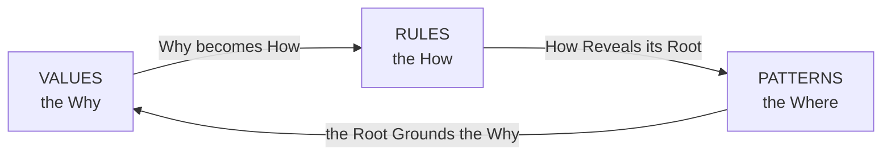
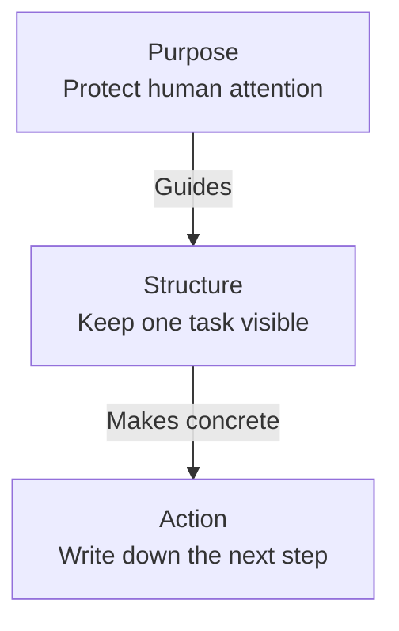
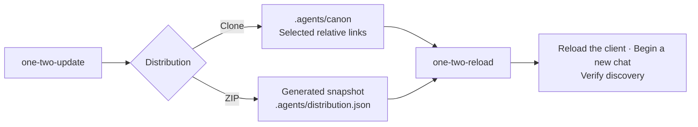
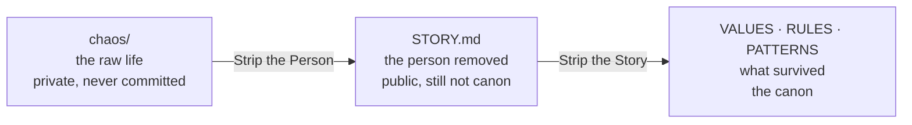

# OneTwoThree

[Español](README.es.md)

OneTwoThree is a Repository that is both a Manifesto and a Codebase.
Its Rules tell an Agent how to read, write and collaborate here.
Its Values and Patterns hold the reasons, so a Person can challenge them.

This Page is the technical Version of the [Presentation](docs/presentation.en.md).
The Presentation tells why; this Page says where each piece lives and how to check it.

## The Repository, in one Map

```text
VALUES.md   the Why       beliefs, in values/
RULES.md    the How       verifiable rules, in rules/
PATTERNS.md the Where     recurring roots, in patterns/
AGENTS.md   the Pointer   what an agent loads on its own
.agents/    agents/ and skills/, the operations
examples/   school/ and pdf/, the rules running in Go
docs/       the Presentation, in English and Spanish
stories/    STORY.md, stories/ and chaos/: context, not yet canon
jokes/      hand-written humour; read it, never add to it
```

Three Documents hold the Manifesto, and this Page indexes them:
[Values](VALUES.md), [Rules](RULES.md) and [Patterns](PATTERNS.md).
An Agent starts at [AGENTS.md](AGENTS.md), then reads [Rules](RULES.md) first.

## The Head is the Canon

The Canon is the head of `main`, and nothing else.
There is no tag, no release and no version: a Rule read from an older commit is a Fork.
[The Head is the Canon](rules/the-head-is-the-canon.md) says why.

[.canonignore](.canonignore) lists the Paths the Canon carries but does not govern.
It uses `.gitignore` syntax, and git reads it directly:

```sh
git ls-files --cached --ignored --exclude-from=.canonignore   # tracked, not governed
git ls-files --others --ignored --exclude-from=.canonignore   # present on disk only
```

An Agent may read every path it lists and must never copy one.

## Why Three

Three comes from a count, not from taste.
With `n` entities there are `n(n-1)/2` possible interactions, and understanding lives in the interactions.

| Entities | Interactions | Reading |
| --- | --- | --- |
| 1 | 0 | Attention, nothing to relate |
| 2 | 1 | One relationship, so one end becomes the center |
| 3 | 3 | Every pair visible, and a cycle closes |
| 4 | 6 | More relationships than things |
| 5 | 10 | The relationships stop being countable |

Three is the last count where both columns match, and the smallest one that closes a cycle.
The Number is a Source to derive from, never a quota to reach.
A situation that holds four categories keeps all four.
See [Three over Four](patterns/three-over-four.md) and [Count me In](patterns/count-me-in.md).

## Values, Rules and Patterns Rotate

[RoTaTion](patterns/de-la-soul-rotation.md) connects the three Documents through three pairs, with no fixed center.
Enter through any Element and follow the relationships.


```mermaid
flowchart LR
    VALUES["VALUES<br/>the Why"] -- "Why becomes How" --> RULES["RULES<br/>the How"]
    RULES -- "How Reveals its Root" --> PATTERNS["PATTERNS<br/>the Where"]
    PATTERNS -- "the Root Grounds the Why" --> VALUES
```

A Rule must be executable by an Agent, or it is a Value.
Rules are verifiable and Values are interpretable.
A Rule marked *Provisional* came from one practice and is deleted if the next project disagrees.

A second reading runs from Purpose to Action in three Layers:


```mermaid
flowchart TD
    PURPOSE["Purpose<br/>Protect human attention"]
    STRUCTURE["Structure<br/>Keep one task visible"]
    ACTION["Action<br/>Write down the next step"]
    PURPOSE -->|Guides| STRUCTURE
    STRUCTURE -->|Makes concrete| ACTION
```

## DeLaCase is a Budget you can Count

[DeLaCase](rules/de-la-case.md) is the typographic Convention for prose.
A capital marks an Entity or an Interaction worth noticing.

1. Split the text into passages at punctuation; a bullet or a hard line break also ends one.
2. Spend at most three emphasis capitals per passage.
3. The grammatical initial is free; proper names and acronyms keep their spelling.

> The Person Guides the Machine, the Machine Supports the Person.

Two passages, each with its own budget, each spending three.
Three is a ceiling, never a quota.

Code keeps its own rule: case in an identifier belongs to the language, and the language decides.
In Go, a capital crosses the package boundary and the compiler enforces it.
Final text in a user interface uses ordinary capitalization.

Bold is a second tier and costs more: one per section, or none.
[Channels](rules/channels.md) counts what a surface can carry, and [Emoji](rules/emoji.md) marks a state, one per line at most.

## The Rules for Code

Every rule that governs code runs in [examples](examples).
[Show me the Code](patterns/show-me-the-code.md) says why that matters.

| Rule | Claim you can check |
| --- | --- |
| [Layers](rules/layers.md) | The Core names no vendor and no socket; the compiler holds the boundary. |
| [Providers](rules/providers.md) | The Core declares an interface; a Port is named for the need, never the vendor. |
| [Shapes](rules/shapes.md) | The entity is never the DTO: Wire, Business and Storage are three types. |
| [Failures](rules/failures.md) | A controlled failure carries its answer; one function maps it to a status. |
| [Constants](rules/constants.md) | Global constants are separate from configuration and validated at startup. |
| [Scripts](rules/scripts.md) | Every program answers `build.sh` and `run.sh`, and each refuses what would fail. |
| [Entrypoints](rules/entrypoints.md) | Doors are declared in one list; a shim only calls the logic. |
| [Tests](rules/tests.md) | The expectation is spelled out, then proven by mutation. |
| [Naming](rules/naming.md) | Verb + Noun + context, three words at most. |
| [Structure](rules/structure.md) | Three beats per function, not three newlines. |

### The School Service

[School](examples/school/README.md) is one API written in Go, Java and TypeScript.
The same [Specification](examples/school/SPEC.md) holds for all three, and [The Before](examples/school/BEFORE.md) shows the original with each broken rule named.

```text
main       casts the players and picks an adapter
adapters   the only files that import a framework
api        the script: handlers and the providers they declare
app        the crossing, the form and the caller
school     the business core: no HTTP, no driver
store      the only package that imports an ORM
wire       the contract, every shape a client sends or receives
faults     controlled failures, each carrying its answer
settings   the strict JSON loader, validated at startup
```

```sh
cd examples/school/go
go list -deps ./school             # lists no vendor and no net/http
./build.sh                         # gofmt, vet, test, then the binary
TOKEN_SECRET=s ./run.sh gin        # stdlib, chi or gin
```

A handler answers with a value or fails, and never builds a reply:

```go
func (a SchoolAPI) ShowStudentRecord(req transport.Request) (any, error) {
	id, err := app.ReadPathNumber(req)
	if err != nil {
		return nil, err
	}

	student, err := a.Students.SelectStudentRow(school.StudentID(id))
	if err != nil {
		return nil, err
	}

	return school.RenderStudentView(student), nil
}
```

Eleven lines, three beats: receive, transform and return.

### The PDF Converter

[PDF](examples/pdf/README.md) renders the manifesto from Markdown to PDF in pure Go.
`markdown/` is the only package that imports goldmark, `render/` the only one that imports gopdf.
`document/` and `style/` import no vendor, and five small functions turn plain Markdown into a booklet.

```sh
cd examples/pdf
./build.sh
./run.sh testdata/sample.md        # writes sample.pdf beside it
```

## Dove and the Skills

[Dove](.agents/agents/dove.md) is an agent that reads an explanation through the manifesto, names the Pattern and takes one bounded step.
The Skills define the operations; each linked file holds the details.

| When | Skill | What it does |
| --- | --- | --- |
| `yo dove` or resume earlier work | [yo-yo-yo](.agents/skills/yo-yo-yo/SKILL.md) | Syncs the project branch, rebuilds context and names one next step. |
| `next`, `sigue` or a selected option | [next-next-next](.agents/skills/next-next-next/SKILL.md) | Takes one recommended step, verifies it and names the following one. |
| A durable edit, decision or validation | [one-two-checkpoint](.agents/skills/one-two-checkpoint/SKILL.md) | Saves the thread in `.handoff.md` during work. |
| A change starts growing | [one-two-growth](.agents/skills/one-two-growth/SKILL.md) | Checks whether one intent still holds the change. |
| Ask for pending stories | [one-two-stories](.agents/skills/one-two-stories/SKILL.md) | Sorts stories by what they wait on and distills the one you pick. |
| Ask to organize, commit and push | [commit-commit-commit](.agents/skills/commit-commit-commit/SKILL.md) | Groups changes by feature, commits each group, pushes once after all succeed. |
| `bye dove` or request a handoff | [bye-bye-bye](.agents/skills/bye-bye-bye/SKILL.md) | Expands the checkpoint into a closing handoff and stops. |
| A secret may have entered history | [one-two-purge](.agents/skills/one-two-purge/SKILL.md) | Detects, confirms and purges an exact value from files and history. |

Supporting skills shape the work as it happens:
[one-two-refactor](.agents/skills/one-two-refactor/SKILL.md) for code,
[de-la-case](.agents/skills/de-la-case/SKILL.md) for names and prose,
[one-two-output](.agents/skills/one-two-output/SKILL.md) for terminal output and
[one-two-joke](.agents/skills/one-two-joke/SKILL.md) for reading the jokes directory.

The [Session Diagram](patterns/the-lever-and-the-tape.md) connects these operations.
A new request with its own intent starts its own work.
Opening a session names the next step, publication and closing each need their own request.

## Connect a Project

[one-two-update](.agents/skills/one-two-update/SKILL.md) installs or updates the canon connection.
[one-two-reload](.agents/skills/one-two-reload/SKILL.md) connects the active client to the selected skills and agents.


```mermaid
flowchart LR
    UPDATE["one-two-update"] --> FORMAT{"Distribution"}
    FORMAT -- "Clone" --> CLONE[".agents/canon<br/>Selected relative links"]
    FORMAT -- "ZIP" --> ZIP["Generated snapshot<br/>.agents/distribution.json"]
    CLONE --> RELOAD["one-two-reload"]
    ZIP --> RELOAD
    RELOAD --> VERIFY["Reload the client · Begin a new chat<br/>Verify discovery"]
```

Existing installations keep their mechanism and local customizations.
A [portable ZIP](.agents/skills/one-two-update/references/zip.md) records its source commit and file inventory.
It is a snapshot; the live canon remains the head of `main`.
Filesystem validation proves the links, and client discovery proves the load.

## How Context Becomes Canon

Three Stages carry a piece of life into the canon, and only the third one stays.


```mermaid
flowchart LR
    CHAOS["chaos/<br/>the raw life<br/>private, never committed"]
    STORY["STORY.md<br/>the person removed<br/>public, still not canon"]
    CANON["VALUES · RULES · PATTERNS<br/>what survived<br/>the canon"]
    CHAOS -- "Strip the Person" --> STORY -- "Strip the Story" --> CANON
```

- A belief goes to Values, a rule an agent can run goes to Rules, a root goes to Patterns.
- A story waits on evidence, on work still moving, or on a decision: BLOCKED.
- Nine Stories fill the passage; distill one before promoting a tenth.
- `chaos/` has its own `.gitignore`, and only its example ships.
- In a code project a decision lands in `docs/`, a rule in code held by a test, a promise in the API contract.

An empty Stories means the canon is current.
[one-two-stories](.agents/skills/one-two-stories/SKILL.md) sorts them, one per turn.

## Agents Work among Others

An Agent needs a Society: explicit authority, independent signals, the right to stop and a human to escalate to.
[Coercion](rules/coercion.md) holds the rules: never invent permission, never retaliate, never let pressure make harm look necessary.

## Verify it

| Check | Command |
| --- | --- |
| Translation pairs intact | the loop in [Translations](rules/translations.md) prints nothing |
| Paths the canon does not govern | `git ls-files --others --ignored --exclude-from=.canonignore` |
| Core imports no vendor | `go list -deps ./school` in `examples/school/go` |
| Examples build and pass | `./build.sh` in each example directory |

## The Name

OneTwoThree draws its name from De La Soul's *The Magic Number*.
One Name, any casing: OneTwoThree and one-two-three mean the same Project.
The rest of the story lives in the [Presentation](docs/presentation.en.md).

## License

This is free and unencumbered software released into the public domain.
Do whatever you want with it.
[The Unlicense](https://unlicense.org)
