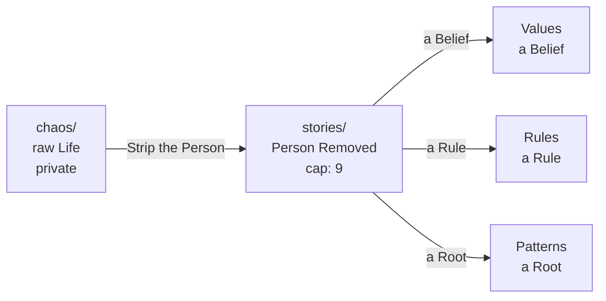

# STORY.md — The Passage between Chaos and Canon

> This file is NOT the project's source of truth.
> Canon lives in Values / Rules / Patterns, which explain themselves;
> README is the door that indexes them.

It is the second of three stages:

- chaos/ holds the whole experience,
  names and dates still in it,
  never committed to the repository.
- What arrives here is the same piece
  with the person removed:
  what remains is the pattern, never the episode.
- Nothing enters this file without that pruning,
  and that is the whole guarantee
  that a public repo never ends up telling a private life.

From here each piece gets distilled and deleted:
a belief goes to Values,
a rule an agent can execute goes to Rules,
a root goes to Patterns.
The full process is in the README,
under "How Context Becomes Canon".

- Cap: nine entries. Once nine are full,
  distill before promoting a tenth.
  A limit generates quality here too.
- This file shrinks; the canon grows.
- Each entry carries its status:
  UNDISTILLED, or SPECULATIVE
  when the connection is still a hunch, not yet a root.

It isn't called AGENTS.md
because Agents load that name as a project instruction.
This file is not that:
AGENTS.md stays free for the short pointer to canon.

## Undistilled Context

7 of 9 filled. Distill before promoting a tenth.

- [Lost work](stories/lost-work.md)
- [Own linter](stories/own-linter.md)
- [examples/before-after](stories/examples-before-after.md)
- [Another three showing up on its own](stories/another-three-showing-up.md) (SPECULATIVE)
- [Modular cluster with LiteLLM](stories/modular-cluster-litellm.md)
- [Ritual as belonging, not belief](stories/ritual-as-belonging-not-belief.md)
- [Color by semantic association](stories/color-by-semantic-association.md)

## Provenance Map

- [Provenance Map](stories/provenance-map.md) — which conversation each thing came from.
