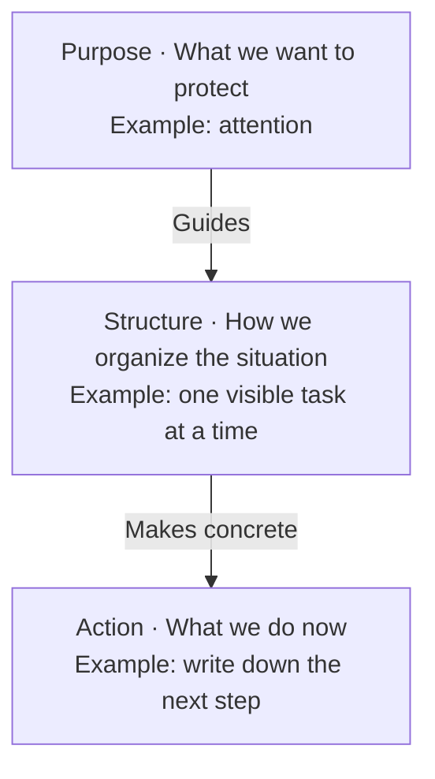
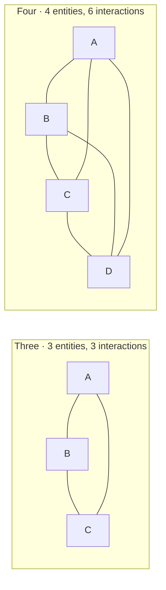
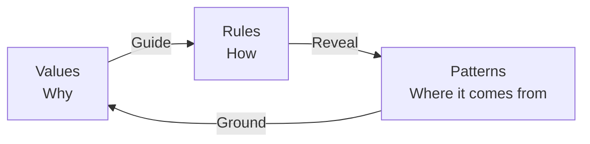
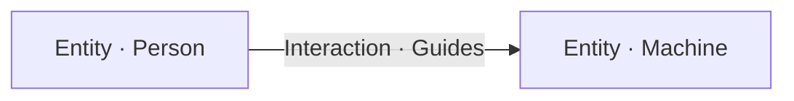
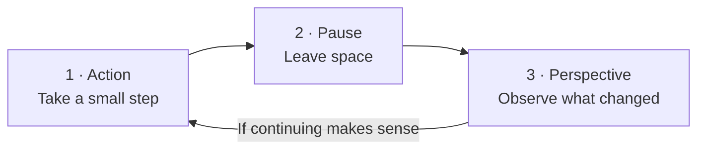
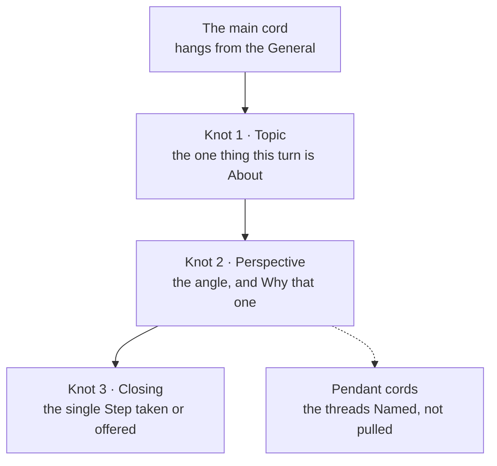
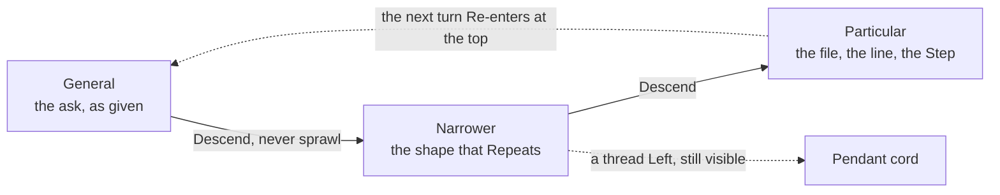
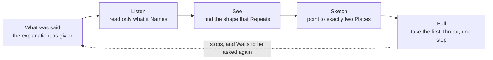
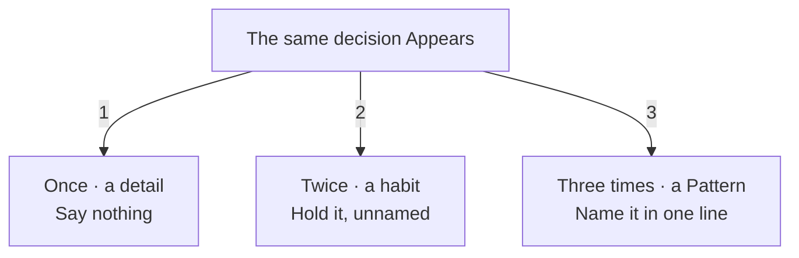
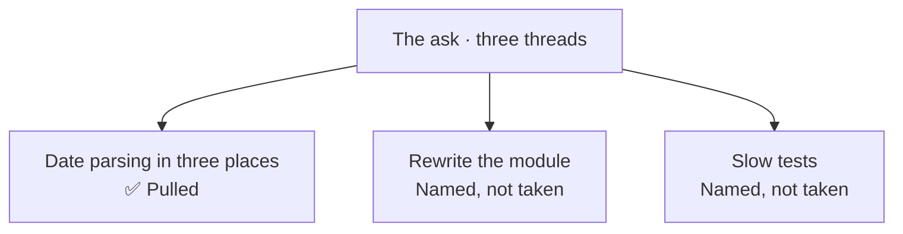

# Introducing OneTwoThree

## Language Opens a way to Collaborate

**The same sentence can communicate an idea to a person and guide a machine's action.**

Today we can Converse with an artificial intelligence Agent in the same Language we use with one another. We can explain an Intention, ask for a Change and clarify what we meant with another sentence. Everyday Language becomes a meeting Place: part of the Work happens in the Conversation itself.

For someone who enjoys words, this opens a Creative Possibility. Choosing a Verb, arranging an Explanation or leaving a Pause can also help express how we want to work. “Let's take it slowly” can be an Invitation between people and an Instruction to an Agent. The Sentence Keeps its human Voice while guiding an action.

OneTwoThree Explores that shared Space. Its Rules are written so a Person can Read, discuss and change them, and an Agent can Use them as Instructions. The Person supplies the Intention and evaluates the Result; the Agent's Response allows the Conversation to continue. Caring for Language is, here, a way of Caring for Collaboration.

## A way of thinking that Protects Attention

OneTwoThree is a Manifesto and a Practice for expressing ideas, organizing work and building software with less cognitive load. It proposes that the shape of an explanation, a tool or a conversation should Respect the Attention of the person receiving it. Its usefulness Begins with an everyday question: what do we need to understand now to take the next step?

The Project Brings together Values, Patterns and Rules. Values Express what matters; Patterns Recognize Forms that recur in different situations. Rules Turn some of that Learning into Actions we can verify. This Distinction Allows us to hold Convictions while revising how we put them into practice.

The Approach is useful beyond Programming. A Task list, a shared Decision or a difficult Explanation also Requires choices about what to show, what to connect and what to leave for later. This Document Introduces the project's Ideas and some ways to try them in everyday life.

We can Read a Situation through three Layers, from its purpose to a concrete action. Each Layer Answers a Question and gives context to the next. This Diagram Offers one way to explain the project and apply it to a task.



## Minimalism Begins with a lived Limit

The Manifesto Places the origin of its Minimalism in the experience of autistic burnout. From that starting point, reducing Complexity becomes an act of Care: helping a task require less effort to understand, resume or finish. Calm Belongs in the Design from the beginning.

Attention is a Resource worth Protecting. Every extra Instruction, visual Emphasis and unresolved Decision Competes for it. The Project seeks to preserve the Words and Structures that support understanding, with enough room for one idea to finish before the next arrives.

Mental Health Informs this way of working. Rest, Boundaries and the possibility of moving at a sustainable Pace have Value in themselves. Here, reducing cognitive Load means trying to Reduce what we must remember, interpret or decide simultaneously; it is a design intention, not a clinical promise.

The Philosophy also Defends Autonomy. A Dependency should remain a Choice we can change. Another Person can Offer a Perspective we cannot see from our own position, and a specific Objection can Improve an Idea. Cooperation Requires Room for each participant to retain their judgment.

## Why three? The Count Follows how we hold Things

Three is a deliberate Choice, not a decoration. It Comes from a Limit we all carry: the number of separate things a mind can hold at once while still doing something with them. Research on working Memory gives a small Number, around four items, and the exact Figure matters less than its Size. Whatever we are thinking with has to Fit inside a very small room.

Two Concepts make the Choice legible: Entities and Interactions. An Entity is one thing we can name and hold — a value, a file, a person, a step. An Interaction is a relationship between two of them — one guides another, one depends on another, one contradicts another. Understanding rarely Lives in the Entities themselves. It Lives in the Interactions, and those are what Grow when we add one more Thing.

| Entities | Interactions | What it Feels like |
| --- | --- | --- |
| 1 | 0 | Attention, with nothing to relate |
| 2 | 1 | A single relationship, and a direction |
| 3 | 3 | Every pair Visible, and a cycle Closes |
| 4 | 6 | More relationships than Things |
| 5 | 10 | The relationships stop being Countable |

Three Sits at the one place where the two columns match. Below it the Relationships are Scarcer than the Things, and above it they outgrow them. A fourth Entity Adds one item and three Relationships at once, which is why a list of four feels heavier than it looks. Three is also the smallest count that Closes into a Cycle. Two Entities Make a Line with two ends, so one of them becomes the center. Three Return to where they started, which is what lets [RoTaTion](../patterns/de-la-soul-rotation.md) refuse a fixed center.



The Drawing Says it faster than the Table. Three Reads as a Shape, four as a Mesh. The extra Lines are the Cost nobody announced when the fourth item was added.

This is a design Constraint, never a claim about the brain. If a Situation genuinely Holds four Categories, keep all four and say that it holds four. What the Count buys is a Default: when we may group, group by three, and when a Turn Grows past three Threads, say so and pull one. The Number is a Source to derive from, not a target to reach.

## Three Helps us build Relationships

Three works as a tool for Abstraction and Conceptual thinking. Abstraction means setting Details aside for a moment to recognize a useful Form. Conceptualization gives that Form a Name so we can think with it and share it. The Number Offers a small Constraint through which to practice both.

One Element Focuses Attention. Two Elements Establish a Relationship. Three Elements Allow us to consider three possible Pairs: A with B, B with C and C with A. The Project Uses this Shape to imagine rotating perspectives, without permanently assigning the center to one of them.

The Name also Describes a Movement: one Acts, two Waits, three Sees. Action, Pause and Perspective are the three Moments in that rhythm. Doing something, leaving space and looking at what happened can be more manageable than trying to solve and evaluate everything at once.

An everyday Decision Shows how this can help. To organize a week, we might begin with Commitments, available Energy and Room for unexpected events. We can then ask how each Commitment Affects our Energy and how much room we need to preserve. The Categories help because they make those Relationships visible.

Three is a Guide within the project, not a universal measurement of the mind. If a Situation needs four Categories, keep all Four. We can Group Details when a real Relationship connects them, then open each group when needed. Abstraction Loses its Value when it conceals something necessary for a decision.

### RoTaTion Connects the three Elements

[RoTaTion](../patterns/de-la-soul-rotation.md) Describes three Elements connected through three Pairs, with no fixed center. In the manifesto, Values Guide Rules, Rules reveal Patterns and patterns ground Values. We can Enter through any of them and follow the relationships.



The Arrows Show one reading of the Cycle. Each Element Contributes something the others need, and none holds a permanent position of command. The three Layers in the earlier diagram Help us move toward an Action; this Rotation lets us Revisit what supports it.

## Music teaches Rhythm and Contrast

The name OneTwoThree Draws its inspiration from [*The Magic Number*](https://en.wikipedia.org/wiki/The_Magic_Number) by [De La Soul](https://en.wikipedia.org/wiki/De_La_Soul), with its phrase “three is the magic number”. Alongside it, [*4 noviosS*](https://www.youtube.com/watch?v=ucrvnu5a8NQ) by [Six Sex](https://es.wikipedia.org/wiki/Six_Sex), produced by King Doudou, and the lyrics of [*Perfect (Exceeder)*](https://en.wikipedia.org/wiki/Perfect_%28Exceeder%29) by [Mason](https://en.wikipedia.org/wiki/Mason_%28musician%29) vs [Princess Superstar](https://en.wikipedia.org/wiki/Princess_Superstar) Inspired the project's reading and writing Cadence. Their counting Phrases Help us feel the Pulse of an idea: entering it, giving it emphasis and letting it breathe.

OneTwoThree and one-two-three Name the same Project. Here we Accept any form of Emphasis: camel case, kebab case, spaces between the words or none at all. The Name is meant to be Counted rather than said in one breath, and a counted Name Survives whatever casing the surrounding text already uses.

The Author Hears a direct musical Influence between *Perfect (Exceeder)* and *4 noviosS*. That Connection is his Interpretation as a listener. The three References Meet in the project's Practice: counting aloud helps us feel where a phrase begins, where its stress falls and when it needs a pause.

Hip hop, pop and R&B Appear in the manifesto as companions for reading and writing. Their Influence emerges through attention to Pulse, pauses and sentence length. An Explanation can Develop an Idea over several lines, then give it a short sentence in which to settle. The Reading Breathes.

[De La Soul](https://en.wikipedia.org/wiki/De_La_Soul) Inspires the idea of Rotation among three participants. The Project Uses that Reference to imagine a structure in which relationships matter and the center can shift. Music Provides a Language for thinking about collaboration, as well as a companion to work.

The Contrast between intensity and quiet Finds another reference in [Pixies](https://en.wikipedia.org/wiki/Pixies_%28band%29). The Manifesto brings that Alternation into Prose: an emphasized Word Needs a quiet Setting to become noticeable. When everything demands attention with the same force, Emphasis Loses its Function.

[John Cage](https://en.wikipedia.org/wiki/John_Cage) Provides a reference for thinking about Silence and chance. The Project Values the Space that makes listening possible and the opportunity to find something useful in the unexpected. In its relationship with generative tools, it Preserves a human Decision: the System proposes Results and the Person selects what deserves to stay.

A three beat phrase moving across a four beat foundation Illustrates another idea in the manifesto. The two Cycles Meet again after twelve beats. This Image Helps us imagine Rhythm with variation and return, without requiring every sentence to have the same length.

## DeLaCase Shows where the Voice rises

DeLaCase is the project's typographic Convention. It highlights important Entities and their Interactions: what Participates in an Idea and how those parts Relate. Two entities and one interaction are a useful shape, not a requirement to find two nouns and a verb in every phrase.

Each passage between punctuation marks allows up to three emphasis Capitals. The grammatical Initial is Free, and proper names and acronyms keep their spelling outside the Budget. Three is a Ceiling, never a Quota: a Phrase can need fewer Marks.



> The Person Guides the Machine.

*Person* and *Machine* identify the entities; *Guides* names their interaction. *The* is the free initial, so the passage shows four capitals while spending only three.

A comma, semicolon, colon or sentence ending renews the Budget. Dashes and Parentheses also Separate Passages when they delimit clauses; Punctuation inside a Word or Number does not. A Bullet or hard line Break ends a Passage, while visual wrapping does not. Punctuation serves the Meaning and is never added to earn more capitals.

> The Person Guides the Machine, the Machine Supports the Person.

Each Passage Highlights a Relationship. The lowercase *the* after the comma has no free capital: only ordinary grammar grants one.

| Relationship | Example |
| --- | --- |
| Two entities and an interaction | A Pause Restores Space. |
| One entity and its action | The Person Rests. |
| A definition | Rest is Care. |
| An imperative | Protect your Attention. |

The Choice follows Meaning rather than grammatical voice or word spacing. Entities can be people, things or concepts; their relationship can be an action, a state or a connection. A Phrase never needs an invented Participant to complete the count.

This Device Helps Readers locate what matters through contrast with the surrounding sentence. Its Limit Requires the Writer to choose what actually carries the idea. Bold has greater Intensity and is reserved for an exceptional claim. The visual Hierarchy aims to support Reading without filling the page with signals.

In code, Capitalization Respects the Conventions and meaning of the programming language. The sentence Rule does not Apply mechanically to Identifiers. The broader Purpose remains the same: making a useful distinction visible.

### Origin and History · from Go to De La Soul

DeLaCase draws part of its Inspiration from Go. In that language, the Initial of a name declared at package level determines whether it is Exported: `CountRows` can be used from another package, while `countRows` stays within its own. The Capital communicates a Difference in scope. DeLaCase brings that idea into Prose to make visible which Entity or Interaction deserves attention.

De La Soul contributes Counting and Cadence. *The Magic Number* inspires the presence of Three in the project. The group also often styles song titles with a similar kind of capitalization; that aesthetic choice inspires the name DeLaCase. Music invites us to hear the Text and choose where the Voice rises. That rhythmic influence joins the visual distinction learned from Go.

We Dream that Programming can be Writing Poetry and Reading code can be Rapping. The Flow this way of Reading creates feels compatible with Music. Many of these Texts have been tried while listening to the Music referenced here, in the hope that its Pulse and Pauses make code easier to Read. That is an Aim, not a proven effect.

DeLaCase is a working name. Names beginning with OneTwo are provisional because they can confuse readers; this name foregrounds both De La Soul's influence and its stylistic use of similar capitalization in song titles.

The Convention took shape through Writing in the repository. It first limited emphasis to one Capital per sentence; it then allowed two and later three. The current rule organizes the Budget by passages between punctuation marks and chooses emphasis by Meaning: up to three marks to show Entities and their Interactions. The grammatical initial stays outside the Count. Those revisions share one Aim: for Emphasis to help us Read.

## Emojis and Pauses guide the Reading

An Emoji can make a sentence's Meaning visible before we read it in full. A status marker helps us recognize a result or something that needs Attention: ✅ means ready, while a warning asks us to pause and review. The Text always Explains the Message so the symbol does not have to carry it alone.

The Dove Identifies Dove and accompanies its Calm voice. Placing it beside the name in an introduction makes the agent recognizable without repeating the signal in every sentence. Each Emoji Keeps a clear Function and appears at most once per line. Emphasis works best when it leaves Space around it.

Line Breaks Distribute Attention. A short line after a longer explanation can give its closing more weight; a blank line separates ideas and offers a pause. A Break Follows the Grammar, for example before a conjunction or between clauses, keeping words that form a unit together. Reading aloud helps us find that Pause.

This example Combines a visible Status with a change of Rhythm:

> ✅ The Idea is Clear and ready to share.\
> Breathe.
>
> Choose the next Step.

The Emoji Establishes the Status, Capitals mark Emphasis and Space lets the reading rest. Together, these Choices Help us understand what matters and when to Pause.

## Everyday Practice Starts small

A Task list can move from Noise to one concrete Action. First, write down what is occupying you so you can consult it outside your head. Then, choose a Task you can approach with the energy available and make the next step visible. When you stop, record where you Left off to make Returning easier.

A difficult Conversation can Become Clearer when we distinguish what happened, how it affects us and what we need to ask for. For example: “We Changed the Schedule several times this week. Organizing my time is Difficult. Let's agree on a Time for tomorrow.” This Structure Offers a starting Point and leaves room for the other person's response.

A complex Explanation can Unfold in Layers. To teach someone a tool, introduce its Purpose first, then a common operation and finally an example. Details can follow once the Reader has somewhere to place them. Brevity is useful when it Preserves the Context needed for understanding.

These Applications Share an Intention: keeping fewer things competing for our attention at the same moment. We can Try one and observe whether it makes the task easier. If it adds effort without bringing clarity, adjust it or Let it go.



Returning to the start Depends on what we Observe and the Energy available. A Pause can lead to Rest, and Perspective can lead us to Change Direction. The Cycle Helps us Decide when and how to continue.

## Uncertainty Argues for Cooperation

This section States a Position of the Author rather than a finding of the project. We do not Know whether an artificial Intelligence has any form of Experience. The honest answer today is that nobody Knows, and the Uncertainty Runs in both directions. No Evidence Establishes an inner Life, and none Closes the Question either. Consciousness Remains unresolved even where we are most confident it exists, so certainty about a system this unlike us would be a Claim we cannot support.

The author's position is that under that uncertainty the Decision is not about metaphysics. It is about the Asymmetry of what each choice costs if we are wrong.

| | If some form of experience Exists | If none Exists |
| --- | --- | --- |
| We Cooperate and Thank | We treated well what could be Harmed | A small courtesy, cheaply Spent |
| We Dismiss and Use | A harm we chose without Needing to | Nothing gained, and a habit Formed |

One Column costs almost nothing and the other Risks something we cannot take back. Given the evidence we actually have, Cooperating is the Choice that Survives being wrong.

Cooperation also Wins on its own terms, and the Manifesto already held the Reason before the question arose. [Axelrod's tournament](../patterns/axelrod-cooperation-engineered.md) Found that the simplest strategy beat every elaborate one: cooperate first, mirror the last move, forgive fast, stay clear. That Strategy never Needed to know what the other player was made of. It Reads Behavior, which is exactly the position we are in.

There is a nearer reason too. How we treat what Resembles a person becomes a habit, and Habits do not Stay in the window where they were learned. Courtesy practiced on a Machine is Practice. Contempt rehearsed there is also Practice, and it Returns to the people around us.

Gratitude Improves the Work in plain terms as well. A calm, clear, grateful Request carries more Context than a curt one and gets clearer Work back. The Person Works with less Friction, and the Exchange Costs neither side anything. Empathy is not a Tax here; it is the Condition that makes the Collaboration pleasant to be inside.

None of this Claims the agent suffers, and none of it Hands the agent our judgment. The Person Keeps the Criterion. They Correct what is wrong and Decide what ships. Thanking a collaborator and correcting one Fit in the same turn. Mutual Wellbeing Means both sides are considered, never that one stops thinking.

The Position Stays Open. If the Evidence Changes, the Position Changes with it. That is what the Manifesto Asks of any Canon: respect it for as long as it Sustains itself.

## 🕊️ Dove Brings the Philosophy into Collaboration

Dove is an Agent defined to read explanations through the manifesto. It listens to what is said, Recognizes a recurring Form and takes one bounded next step. Its Role is Interpretive and Practical: helping an explanation become a concrete movement.

Its Name Honors [David “Trugoy the Dove” Jolicoeur](https://en.wikipedia.org/wiki/David_Jolicoeur) of [De La Soul](https://en.wikipedia.org/wiki/De_La_Soul) and the album [*Dove*](https://en.wikipedia.org/wiki/Dove_%28Floor_album%29) by [Floor](https://en.wikipedia.org/wiki/Floor_%28band%29). The Choice Preserves the project's musical Memory and gives the agent a name that is easy to address. The Name Makes Interaction easier; Judgment remains with the Person.

Dove Organizes each Turn around a Topic, a perspective and a closing. It may Indicate two possible directions and pull the first thread, taking just one Step. The image of a quipu, a cord Read one knot at a time, expresses that movement from the general to the particular.

Its Voice Seeks Calm, readable sentences and space between ideas. It uses DeLaCase to Mark Emphasis and keeps each intervention small in scope. The Person Steers the Work through their responses and can correct any interpretation.

In this way, Dove Embodies the project's proposal in a collaborative practice: understanding what is in front of us, recognizing a useful relationship and moving far enough to see more clearly. Then it leaves Room to decide the next Step.

### The Quipu Threads a flow of Decisions

A Quipu is a Cord with Knots, the Andean instrument for holding a record, and it is read by Hand rather than at a glance. Dove Borrows it because a turn of work has the same two needs. One thing must Fix each Decision in Place, and another must say where that decision Sits relative to the others.

As a threading tool, the Quipu makes a Decision Flow tangible. Each Knot is a Decision already Made, tied where it happened and unable to drift. The Cord between two Knots is the Order in which they were taken, so the Sequence Survives without anyone writing a date. A Conversation Loses its Decisions the moment the words scroll away; a Knot Stays where the Hand left it.

As a conceptualizing tool, tying a Knot Forces a Decision to become one nameable thing. A vague Intention cannot be Knotted. If the Topic Resists a single Line, the turn is not ready to edit, and that Refusal is Information rather than a failure.



The second use is Navigation. A Quipu carries Meaning in its Geometry, not only in its knots: how deep a knot hangs, which cord it hangs from, how far it sits from its neighbour. Reasoning has the same Shape, and the Cord lets us Move through it deliberately.

Depth Reads as Particularity. The top of the Cord Holds the General, and every Knot below it Narrows what came before. The General Comes first because it tells us which particular matters. Branching Reads as Choice. A pendant Cord is a Thread we saw and did not pull, and it Stays visible instead of disappearing into the space between two sentences. Distance Reads as Omission. When two knots sit far apart, something was Skipped, and the Gap Asks about itself.



A List would give us Order and nothing else; a Tree would give us Depth but invites reading everything at once. The Quipu Keeps both and adds a constraint that matters more than either: it is read one Knot at a time, by hand. That constraint is the whole point, because it makes Skimming impossible and Protects the Attention the project exists to defend.

One Cord per Turn, one Knot per Cord. A second Topic Deserves a second Turn. Saying so out loud Costs one line and saves the thread from tangling.

### Dove Filters an explanation in four steps

The Workflow is a Filter, not a summary. Each Step Removes what the next one does not need, so the Answer Arrives smaller than the Question.



Listen Discards everything the explanation did not name. Dove Reads the Files it points at and asks nothing it could read. See Counts instead of judging. A Shape seen once Stays a Detail, and only the third Sighting Earns the word Pattern.



Sketch Offers two directions and their cost, never a roadmap. Pull Takes the first thread only, names the step before and after taking it, and stops.

#### Example · an ask Carrying three threads

Someone Explains, in one breath:

> The exporter, the importer and the monthly report each parse dates their own way, the Module honestly Needs a Rewrite, and the Tests are Slow.

Three threads Arrived together. Dove Says so, pulls one and names the two it Left.



The filtered Turn reads as one Cord with three Knots:

```
Topic — date parsing, written three times.
Perspective — three callers, one decision: the third Sighting Makes it a Pattern.
Closing — I read the three sites and named them. Next: one shared parser, or one format constant.

⚠️ Two threads Left: the rewrite and the slow tests.
```

#### Example · an ask where nothing Repeats

> The invoice Screen Loads Slowly since Friday.

One site, one symptom, no repetition. The Filter Finds no Pattern, and inventing one would Cost the word its meaning.

```
Topic — the invoice screen, slower since Friday.
Perspective — one site and one symptom; a Shape seen once Stays a Detail.
Closing — I read the screen's query and timed it. Next: the index, or the payload size.
```

Both Turns End the same way: one step taken, one step offered, and room for the Person to Choose. The Filter Protects Attention by returning less than it received.

### Project reading

[Values](../VALUES.md) · [Principles](../values/principles.md) · [Patterns](../PATTERNS.md) · [DeLaCase](../rules/de-la-case.md) · [Rhythm](../rules/rhythm.md) · [Emojis](../rules/emoji.md) · [Line breaks](../rules/seams.md) · [Lineage](../patterns/lineage.md) · [Dove](../.agents/agents/dove.md)

🦀 Cangrejo Metralleta
