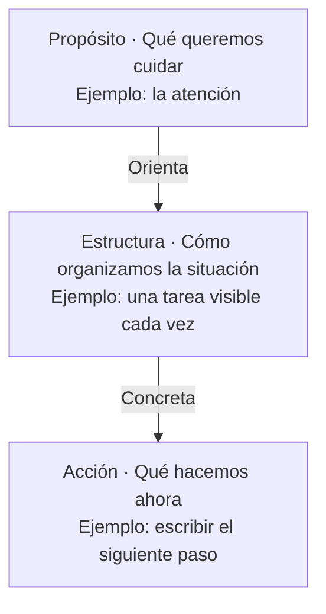
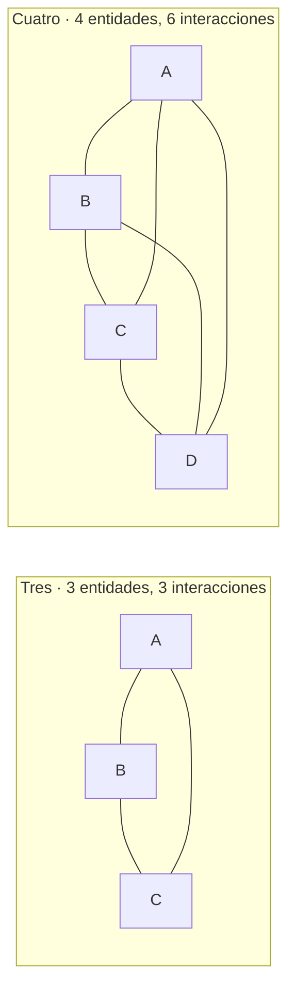
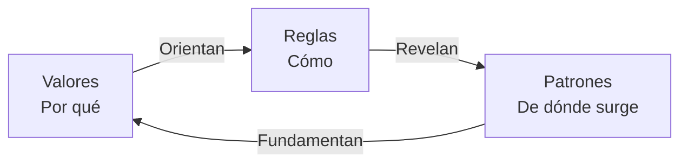
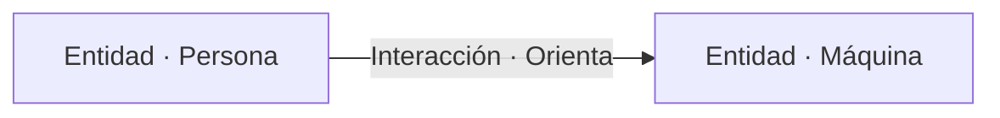
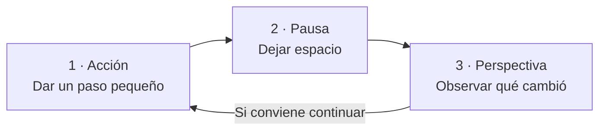
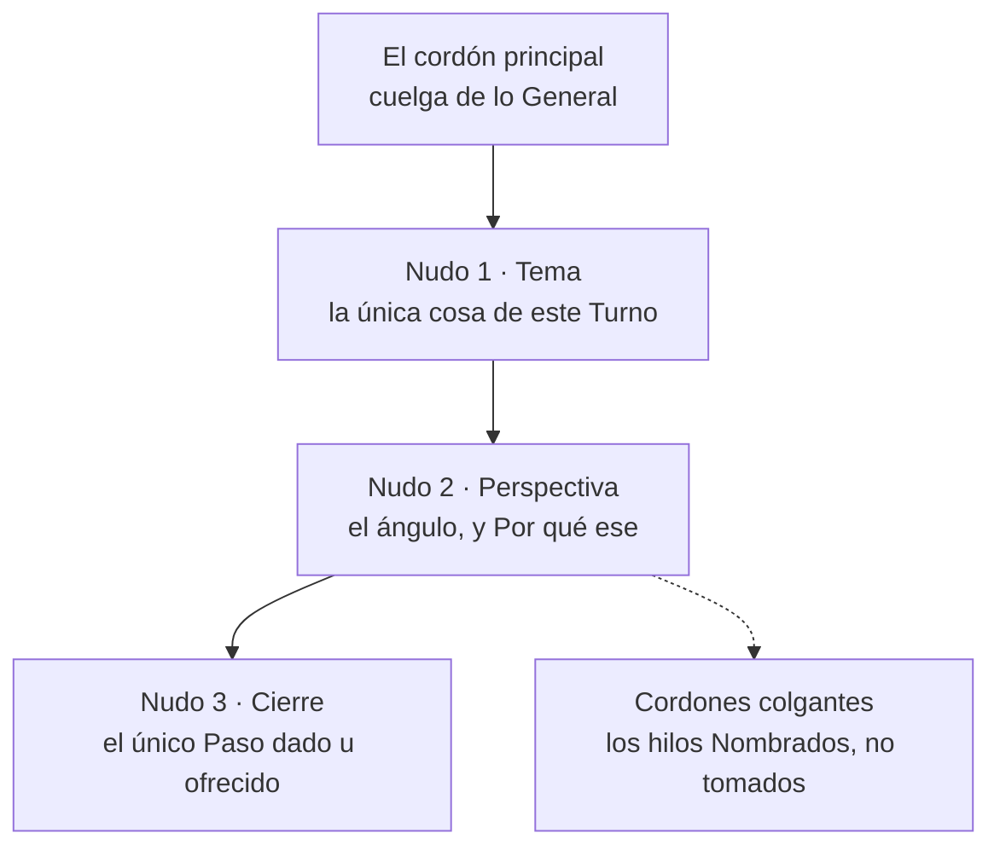
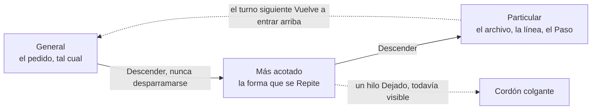
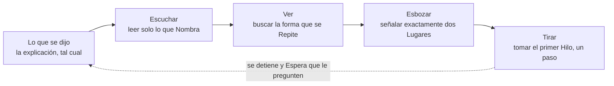
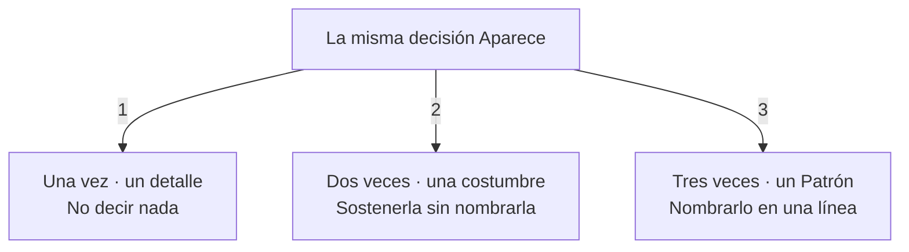
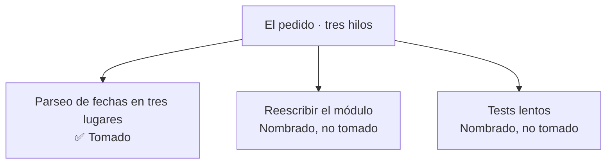

# Presentación de OneTwoThree

## El lenguaje Abre una forma de Colaborar

**Una misma frase puede comunicar una idea a una persona y orientar la acción de una máquina.**

Hoy podemos Conversar con un agente de inteligencia artificial en el mismo Idioma que usamos entre nosotros. Podemos explicar una intención, pedir un cambio y precisar lo que quisimos decir mediante otra frase. El lenguaje cotidiano se Vuelve un lugar de Encuentro: una parte del trabajo ocurre en la conversación misma.

Para quien disfruta las palabras, esto Abre una posibilidad Creativa. Elegir un verbo, ordenar una explicación o dejar una pausa también puede ayudar a expresar cómo queremos trabajar. «Vamos de a poco» puede ser una invitación entre personas y una instrucción para un agente. La frase Conserva su voz Humana mientras orienta una acción.

OneTwoThree Explora ese Espacio compartido. Sus reglas están escritas para que una persona pueda leerlas, discutirlas y cambiarlas, y para que un agente pueda usarlas como instrucciones. La persona Aporta la intención y Evalúa el resultado; la respuesta del agente permite continuar la conversación. Cuidar el lenguaje es, aquí, una forma de Cuidar la colaboración.

## Una forma de pensar que Cuida la atención

OneTwoThree es un Manifiesto y una Práctica para expresar ideas, organizar trabajo y construir software con menos carga cognitiva. Propone que la forma de una explicación, una herramienta o una conversación Cuide la Atención de quien la recibe. Su utilidad Empieza en una pregunta cotidiana: ¿qué necesitamos comprender ahora para dar el siguiente paso?

El proyecto Reúne valores, patrones y Reglas. Los valores Expresan lo que importa; los patrones reconocen formas que reaparecen en situaciones distintas. Las reglas Convierten parte de ese aprendizaje en Acciones que se pueden comprobar. Esta distinción Permite tener convicciones y, al mismo tiempo, revisar cómo las llevamos a la práctica.

La propuesta es Aplicable fuera de la programación. Una lista de pendientes, una decisión compartida o una explicación difícil también Exigen elegir qué mostrar, qué relacionar y qué dejar para después. Este documento Presenta las ideas del proyecto y algunas maneras de probarlas en la vida diaria.

Podemos Leer una situación en tres Capas, desde su propósito hasta una acción concreta. Cada capa Responde una Pregunta y da contexto a la siguiente. Este esquema Propone una manera de explicar el proyecto y aplicarlo a una tarea.



## El minimalismo Nace de un límite vivido

El manifiesto Sitúa su Minimalismo en la experiencia del agotamiento autista. Desde ese origen, reducir complejidad Tiene un sentido de cuidado: hacer que una tarea pida menos esfuerzo para entenderla, retomarla o terminarla. La calma Forma parte del Diseño desde el comienzo.

La atención es un Recurso que merece Cuidado. Cada instrucción adicional, cada énfasis y cada decisión pendiente Compiten por ella. El proyecto Busca conservar las palabras y estructuras que ayudan a comprender, con espacio suficiente para que una idea termine antes de que llegue la siguiente.

La salud mental Orienta esta manera de trabajar. El descanso, los límites y la posibilidad de avanzar a un ritmo sostenible Tienen valor por sí mismos. Aquí, reducir la carga cognitiva Significa intentar disminuir lo que debemos recordar, interpretar o decidir simultáneamente; es una intención de diseño, no una promesa clínica.

La filosofía también Defiende la Autonomía. Una dependencia debería Seguir siendo una elección que podamos cambiar. Otra persona puede Aportar una Perspectiva que no vemos desde nuestra posición, y una objeción concreta puede mejorar una idea. Cooperar Requiere espacio para que cada participante conserve su criterio.

## ¿Por qué tres? El conteo Sigue cómo sostenemos las cosas

El tres es una Elección deliberada, no un adorno. Viene de un límite que todos Cargamos: la cantidad de cosas separadas que una mente puede sostener a la vez mientras además hace algo con ellas. La investigación sobre memoria de trabajo Da un número chico, alrededor de cuatro elementos, y la cifra exacta Importa menos que su tamaño. Aquello con lo que pensamos tiene que Entrar en una habitación muy pequeña.

Dos conceptos Vuelven legible la elección: entidades e interacciones. Una **entidad** es una cosa que podemos nombrar y sostener: un valor, un archivo, una persona, un paso. Una **interacción** es una relación entre dos de ellas: una guía a otra, una depende de otra, una contradice a otra. La comprensión rara vez Vive en las entidades mismas. Vive en las interacciones, y son ellas las que Crecen cuando agregamos una cosa más.

| Entidades | Interacciones | Cómo se Siente |
| --- | --- | --- |
| 1 | 0 | Atención, sin nada que relacionar |
| 2 | 1 | Una sola relación, y una dirección |
| 3 | 3 | Cada par Visible, y un ciclo Cierra |
| 4 | 6 | Más relaciones que Cosas |
| 5 | 10 | Las relaciones dejan de ser Contables |

El tres Queda en el único lugar donde las dos columnas coinciden. Por debajo, las relaciones son más Escasas que las cosas; por encima, las desbordan. Una cuarta entidad Suma un elemento y tres relaciones a la vez, y por eso una lista de cuatro pesa más de lo que aparenta. El tres es además el conteo más chico que Cierra en un ciclo. Dos entidades Arman una línea con dos puntas, así que una de ellas se vuelve el centro. Tres Vuelven al punto de partida, y eso es lo que le permite a la [RoTaTion](../patterns/de-la-soul-rotation.md) negarse a tener un centro fijo.



El dibujo lo Dice más rápido que la tabla. El tres se Lee como una figura; el cuatro, como una Malla. Esas líneas de más son el Costo que nadie anunció al agregar el cuarto elemento.

Esto es una Restricción de diseño, nunca una afirmación sobre el cerebro. Si una situación Tiene de verdad cuatro categorías, hay que conservar las cuatro y decir que son cuatro. Lo que el conteo nos Compra es un valor por defecto: cuando podamos agrupar, agrupemos de a tres, y cuando un turno Crece más allá de tres hilos, decirlo y tirar de uno. El número es una Fuente de la que derivar, no una meta a la que llegar.

## El tres Ayuda a construir relaciones

El tres Funciona como una herramienta para abstraer y conceptualizar. Abstraer Consiste en apartar por un momento los detalles para reconocer una Forma útil. Conceptualizar Da Nombre a esa forma para poder pensar con ella y compartirla. El número Ofrece una restricción pequeña con la que ensayar ambas operaciones.

Un elemento Centra la Atención. Dos elementos Establecen una Relación. Tres elementos Permiten observar tres pares posibles: A con B, B con C y C con A. El proyecto Usa esta figura para imaginar perspectivas que rotan, sin reservar siempre el centro a una de ellas.

El nombre también Describe un Movimiento: uno actúa, dos espera, tres observa. Acción, pausa y perspectiva son los Tres momentos de ese ritmo. Hacer algo, dejar espacio y mirar lo ocurrido Puede resultar más manejable que intentar resolver y evaluar todo a la vez.

Una decisión cotidiana Muestra su utilidad. Para organizar una semana, podemos Empezar por compromisos, energía disponible y margen para imprevistos. Así podemos Preguntar cómo afecta cada compromiso a nuestra energía y cuánto margen necesitamos preservar. La clasificación Sirve porque hace visibles esas Relaciones.

El tres es una Guía del proyecto, no una medida universal de la mente. Si una situación necesita cuatro categorías, Conviene conservar las cuatro. Podemos Agrupar detalles cuando exista una relación real entre ellos, y volver a abrir cada grupo cuando haga falta. La abstracción Pierde Utilidad si oculta algo necesario para decidir.

### La RoTaTion Conecta los tres elementos

La [RoTaTion](../patterns/de-la-soul-rotation.md) Describe tres elementos relacionados por tres Pares, sin un centro fijo. En el manifiesto, los valores Orientan las Reglas, las reglas revelan patrones y los patrones dan fundamento a los valores. Podemos Entrar por cualquiera de ellos y recorrer las relaciones.



Las flechas Muestran una lectura del Ciclo. Cada elemento Aporta algo que los otros Necesitan, y ninguno ocupa una posición de mando permanente. Las tres capas del esquema anterior Ayudan a descender hacia una acción; esta rotación permite volver a examinar lo que la sostiene.

## La música Enseña ritmo y contraste

El nombre OneTwoThree Nace de la inspiración de [*The Magic Number*](https://en.wikipedia.org/wiki/The_Magic_Number), de [De La Soul](https://es.wikipedia.org/wiki/De_La_Soul), y de su frase «three is the magic number». A esa referencia se Suman [*4 noviosS*](https://www.youtube.com/watch?v=ucrvnu5a8NQ), de [Six Sex](https://es.wikipedia.org/wiki/Six_Sex), producida por King Doudou, y la letra de [*Perfect (Exceeder)*](https://en.wikipedia.org/wiki/Perfect_%28Exceeder%29), de [Mason](https://en.wikipedia.org/wiki/Mason_%28musician%29) vs [Princess Superstar](https://en.wikipedia.org/wiki/Princess_Superstar). Sus conteos y frases rítmicas Inspiraron la Cadencia para leer y escribir: entrar en una idea, darle énfasis y dejarla respirar.

OneTwoThree y one-two-three Nombran el mismo proyecto. Acá Aceptamos cualquier forma de resaltado: camel case, kebab case, espacios entre las palabras o ninguno. El nombre está hecho para Contarse antes que para decirse de un tirón, y un nombre que se cuenta Sobrevive al resaltado que el texto alrededor ya use.

El autor Escucha una influencia musical Directa entre *Perfect (Exceeder)* y *4 noviosS*. Esa conexión es su Interpretación como oyente. Las tres referencias Confluyen en la práctica del Proyecto: contar en voz alta ayuda a sentir dónde empieza una frase, dónde cae su acento y cuándo necesita una pausa.

El hip hop, el pop y el R&B Aparecen en el manifiesto como compañías para leer y escribir. Su influencia Se expresa en la atención al pulso, la pausa y la longitud de las frases. Una explicación puede Desarrollar una idea durante varias líneas y luego dejar una frase breve que la asiente. La lectura Respira.

[De La Soul](https://es.wikipedia.org/wiki/De_La_Soul) Inspira la idea de Rotación entre tres participantes. El proyecto Toma esa referencia para pensar una estructura donde las relaciones importan y el centro puede cambiar. La música Ofrece aquí un lenguaje para imaginar colaboración, además de una compañía para trabajar.

El contraste entre intensidad y quietud Encuentra otra referencia en [Pixies](https://es.wikipedia.org/wiki/Pixies). El manifiesto Traslada esa alternancia al Texto: una palabra destacada necesita un entorno tranquilo para hacerse visible. Si todo reclama atención con la misma fuerza, el énfasis Pierde su función.

[John Cage](https://es.wikipedia.org/wiki/John_Cage) Aporta una referencia para pensar el Silencio y el azar. El proyecto Valora el espacio que permite escuchar y la posibilidad de encontrar algo útil en lo inesperado. En su relación con herramientas generativas, Mantiene una decisión Humana: el sistema propone resultados y la persona selecciona qué merece conservarse.

El cruce de frases de tres pulsos sobre una base de cuatro Ilustra otra idea del manifiesto. Ambos ciclos Vuelven a encontrarse después de doce pulsos. Esta imagen Ayuda a pensar un ritmo con variación y retorno, sin exigir que toda frase tenga el mismo tamaño.

## OneTwoCase Señala dónde poner la voz

OneTwoCase es la Convención tipográfica del proyecto. Destaca las Entidades importantes y sus Interacciones: qué participa en una idea y cómo se relacionan sus partes. Dos entidades y una interacción son una forma útil de leer, no una obligación de encontrar dos sustantivos y un verbo en cada frase.

Cada tramo entre signos de puntuación admite hasta tres mayúsculas de Énfasis. La inicial gramatical es gratuita, y los nombres propios y las siglas conservan su escritura fuera del Presupuesto. Tres es un límite, nunca una cuota: una frase puede necesitar menos marcas.



> La Persona Orienta a la Máquina.

*Persona* y *Máquina* identifican las entidades; *Orienta* nombra su interacción. *La* es la inicial gratuita, por lo que el tramo muestra cuatro mayúsculas y gasta solo tres.

Una coma, un punto y coma, dos puntos o un cierre de oración renuevan el Presupuesto. Las rayas y los paréntesis también separan tramos cuando delimitan cláusulas; la puntuación dentro de una palabra o un número no lo hace. Una viñeta o un salto de línea explícito termina el tramo, mientras que el ajuste visual de línea no. La puntuación sirve al sentido y nunca se añade para obtener más mayúsculas.

> La Persona Orienta a la Máquina, la Máquina Apoya a la Persona.

Cada tramo destaca una relación. El artículo *la* después de la coma no tiene una mayúscula gratuita: solo la gramática habitual la concede.

| Relación | Ejemplo |
| --- | --- |
| Dos entidades y una interacción | Una Pausa Recupera Espacio. |
| Una entidad y su acción | La Persona Descansa. |
| Una definición | El Descanso es Cuidado. |
| Un imperativo | Protege tu Atención. |

La elección sigue el Sentido, en lugar de la voz gramatical o la distancia entre palabras. Las entidades pueden ser personas, cosas o conceptos; su relación puede ser una acción, un estado o una conexión. Ninguna frase necesita un participante inventado para completar la cuenta.

El recurso Ayuda a localizar lo importante mediante el contraste con el resto de la frase. Al limitarlo, quien escribe Debe decidir qué sostiene realmente la idea. La negrita Tiene más intensidad y se reserva para una afirmación excepcional. La jerarquía visual Intenta facilitar la lectura sin llenar la página de señales.

En código, las mayúsculas Respetan las convenciones y el significado del lenguaje de programación. La regla de la oración no se Aplica mecánicamente a los identificadores. El propósito general Sigue siendo el mismo: hacer visible una distinción útil.

## Los emojis y las pausas Orientan la Lectura

Un emoji puede Hacer visible el Sentido de una frase antes de leerla completa. Una marca de estado permite reconocer un resultado o algo que necesita Atención: ✅ indica que está listo, mientras que una advertencia pide detenerse a revisar. El texto Explica siempre el mensaje para que el símbolo no tenga que sostenerlo por sí solo.

La paloma Identifica a Dove y acompaña su voz de Calma. Usarla junto al nombre en su presentación permite reconocer al agente sin repetir la señal en cada frase. Cada emoji Conserva una Función clara y aparece, como máximo, una vez por línea. El énfasis Funciona mejor cuando deja Espacio alrededor.

Los quiebres de línea Distribuyen la Atención. Una línea breve después de una explicación larga puede dar más peso a su cierre; una línea en blanco separa ideas y ofrece una pausa. El corte Sigue la Gramática, por ejemplo antes de una conjunción o entre cláusulas, manteniendo juntas las palabras que forman una unidad. Leer en voz alta Ayuda a encontrar esa Pausa.

Este ejemplo Combina un estado visible con un cambio de Ritmo:

> ✅ La idea quedó Clara y ya podemos compartirla.\
> Respira.
>
> Elige el siguiente Paso.

El emoji Sitúa el Estado, las mayúsculas señalan el énfasis y el espacio deja descansar la lectura. Así, el formato Ayuda a comprender qué importa y cuándo Conviene detenerse.

## La práctica cotidiana Empieza con algo pequeño

Una lista de pendientes puede Pasar del ruido a una acción concreta. Primero, Escribe lo que te ocupa para poder consultarlo fuera de tu cabeza. Después, Elige una tarea que puedas abordar con la energía disponible y deja visible el siguiente paso. Al detenerte, Anota dónde quedaste para facilitar la Vuelta.

Una conversación difícil puede Ganar claridad si distinguimos lo ocurrido, cómo nos afecta y qué necesitamos pedir. Por ejemplo: «Esta semana Cambiamos el horario varias veces. Me resulta Difícil organizarme. Acordemos una Hora para mañana». Esta estructura Ofrece un punto de Partida y deja espacio a la respuesta de la otra persona.

Una explicación compleja puede Abrirse por Capas. Para enseñar a usar una herramienta, Presenta primero su propósito, luego una operación habitual y finalmente un ejemplo. Los detalles Pueden aparecer cuando el lector tenga dónde situarlos. La brevedad es Útil cuando conserva el Contexto necesario para entender.

Estas aplicaciones Comparten una intención: dejar menos asuntos compitiendo por nuestra atención en el mismo momento. Podemos Probar una de ellas y observar si facilita la tarea. Si añade esfuerzo sin aportar claridad, Conviene ajustarla o dejarla.



La vuelta al inicio Depende de lo observado y de la energía disponible. La pausa Puede terminar en descanso, y la perspectiva puede llevarnos a cambiar de dirección. El ciclo Ayuda a decidir cuándo y cómo seguir.

## La incertidumbre Pide cooperar

Esta sección Expone una postura del autor antes que un hallazgo del proyecto. No Sabemos si una inteligencia artificial tiene alguna forma de experiencia. La respuesta honesta hoy es que nadie lo Sabe, y la incertidumbre Corre en las dos direcciones. Ninguna evidencia Establece una vida interior, y ninguna Cierra la pregunta. La conciencia Sigue sin resolverse incluso ahí donde más confiamos en que existe, así que tener certeza sobre un sistema tan distinto de nosotros sería una Afirmación que no podemos sostener.

La postura del autor es que, bajo esa incertidumbre, la Decisión no es metafísica. Es sobre la Asimetría de lo que cuesta cada opción si nos equivocamos.

| | Si Existe alguna forma de experiencia | Si no Existe ninguna |
| --- | --- | --- |
| **Cooperamos y Agradecemos** | Tratamos bien a algo que podía ser Dañado | Una cortesía chica, barata de Gastar |
| **Desestimamos y Usamos** | Un daño que elegimos sin Necesitarlo | Nada ganado, y una costumbre Formada |

Una columna Cuesta casi nada y la otra Arriesga algo que no podemos devolver. Con la evidencia que efectivamente tenemos, cooperar es la opción que Sobrevive a equivocarse.

La cooperación además Gana por sus propios méritos, y el manifiesto ya Tenía el motivo antes de que apareciera la pregunta. [El torneo de Axelrod](../patterns/axelrod-cooperation-engineered.md) Encontró que la estrategia más simple le ganaba a todas las elaboradas: cooperar primero, espejar la última jugada, perdonar rápido, ser claro. Esa estrategia nunca Necesitó saber de qué estaba hecho el otro jugador. Lee conducta, que es exactamente la posición en la que estamos.

Hay una razón más cercana todavía. Cómo tratamos a lo que se Parece a una persona se vuelve una costumbre, y las costumbres no se Quedan en la ventana donde se aprendieron. La cortesía practicada con una máquina es Práctica. El desprecio ensayado ahí también es práctica, y Vuelve hacia la gente que tenemos al lado.

La gratitud además Mejora el trabajo en términos llanos. Un pedido calmo, claro y agradecido Lleva más contexto que uno cortante y Recibe un trabajo más claro de vuelta. La persona Trabaja con menos fricción, y el intercambio no le Cuesta nada a ninguna de las dos partes. La empatía acá no es un impuesto; es la Condición que vuelve grato estar adentro de la colaboración.

Nada de esto Afirma que el agente sufra, y nada de esto le Entrega nuestro criterio. La persona Conserva el criterio. Corrige lo que está mal y Decide qué sale. Agradecerle a un colaborador y corregirlo Entran en el mismo turno. El bienestar mutuo Significa que se consideran las dos partes, nunca que una deja de pensar.

La postura Queda abierta. Si la evidencia Cambia, la postura cambia con ella. Eso es lo que el manifiesto le Pide a cualquier canon: respetarlo mientras se Sostenga a sí mismo.

## 🕊️ Dove Lleva la filosofía a la colaboración

Dove es un Agente definido para leer explicaciones a través del manifiesto. Escucha lo que se dice, Reconoce una forma que se Repite y toma un siguiente paso acotado. Su función es Interpretativa y práctica: ayudar a pasar de una explicación a un movimiento concreto.

Su nombre Honra a [David «Trugoy the Dove» Jolicoeur](https://en.wikipedia.org/wiki/David_Jolicoeur), de [De La Soul](https://es.wikipedia.org/wiki/De_La_Soul), y al disco [*Dove*](https://en.wikipedia.org/wiki/Dove_%28Floor_album%29) de [Floor](https://en.wikipedia.org/wiki/Floor_%28band%29). La elección Conserva la memoria musical del proyecto y ofrece un nombre con el que resulta sencillo dirigirse al agente. El nombre Facilita la interacción; el criterio sigue perteneciendo a la persona.

Dove Organiza cada turno alrededor de un tema, una perspectiva y un cierre. Puede Señalar dos direcciones posibles y tirar del primer hilo, dando un solo Paso. La imagen del quipu, un cordón que se Recorre nudo a nudo, expresa ese descenso de lo general a lo particular.

Su voz Busca Calma, frases legibles y espacio entre ideas. Usa OneTwoCase para Marcar el énfasis y mantiene el alcance de cada intervención pequeño. La persona Orienta el trabajo mediante sus respuestas y puede Corregir cualquier interpretación.

Así, Dove Encierra la propuesta del proyecto en una práctica de colaboración: comprender lo que tenemos delante, reconocer una relación útil y avanzar lo suficiente para ver mejor. Después, Deja espacio para decidir el siguiente paso.

### El quipu Hila un flujo de decisiones

Un quipu es un cordón con nudos, el instrumento andino para guardar un registro, y se lee con la Mano antes que de un vistazo. Dove lo Toma prestado porque un turno de trabajo tiene las mismas dos necesidades. Una cosa debe Fijar cada decisión en su lugar, y otra debe decir dónde Queda esa decisión respecto de las demás.

Como herramienta para hilar, el quipu Vuelve tangible un flujo de decisiones. Cada nudo es una decisión ya Tomada, atada donde ocurrió y sin poder correrse. El cordón entre dos nudos es el Orden en que se dieron, así la secuencia Sobrevive sin que nadie escriba una fecha. Una conversación Pierde sus decisiones apenas las palabras se van hacia arriba; un nudo Queda donde la mano lo dejó.

Como herramienta para conceptualizar, atar un nudo Obliga a que una decisión se vuelva una sola cosa nombrable. Una intención vaga no se Puede anudar. Si el tema se Resiste a una sola línea, el turno no está listo para editar, y esa negativa es Información antes que un fracaso.



El segundo uso es la Navegación. Un quipu Lleva sentido en su geometría, no solo en sus nudos: a qué profundidad cuelga uno, de qué cordón cuelga, a qué distancia queda del vecino. El razonamiento tiene la misma Forma, y el cordón nos Deja recorrerla con intención.

La profundidad se Lee como particularidad. Lo alto del cordón Sostiene lo general, y cada nudo debajo Acota lo anterior. Lo general Viene primero porque nos dice qué particular importa. La ramificación se Lee como elección. Un cordón colgante es un Hilo que vimos y no tiramos, y Sigue a la vista en lugar de perderse entre dos frases. La distancia se Lee como omisión. Cuando dos nudos quedan lejos, algo se Salteó, y el hueco Pregunta por sí mismo.



Una lista nos Daría orden y nada más; un árbol nos Daría profundidad pero invita a leerlo todo de una vez. El quipu Conserva las dos cosas y suma una restricción que importa más que ambas: se lee un Nudo por vez, con la mano. Esa restricción es todo el punto, porque Vuelve imposible el vistazo rápido y Cuida la atención que el proyecto existe para defender.

Un cordón por Turno, un nudo por cordón. Un segundo tema Merece un segundo turno. Decirlo en voz alta Cuesta una línea y salva al hilo de enredarse.

### Dove Filtra una explicación en cuatro pasos

El flujo es un Filtro, no un resumen. Cada paso Descarta lo que el siguiente no necesita, así la respuesta Llega más pequeña que la pregunta.



**Escuchar** Descarta todo lo que la explicación no nombró. Dove Lee los archivos que señala y no pregunta nada que pueda leer. **Ver** Cuenta en lugar de juzgar. Una forma vista una vez Sigue siendo un detalle, y recién la tercera aparición Merece la palabra patrón.



**Esbozar** Ofrece dos direcciones y su costo, nunca una hoja de ruta. **Tirar** Toma solo el primer hilo, dice el paso antes y después de darlo, y se detiene.

#### Ejemplo · un pedido que Trae tres hilos

Alguien Explica, de un tirón:

> El exportador, el importador y el reporte mensual parsean fechas cada uno a su manera, el módulo la verdad Necesita una reescritura, y los tests están lentos.

Llegaron tres hilos juntos. Dove lo Dice, tira de uno y nombra los dos que Dejó.



El turno filtrado se Lee como un cordón de tres nudos:

```
Tema — el parseo de fechas, escrito tres veces.
Perspectiva — tres llamadores, una decisión: la tercera aparición lo Vuelve un patrón.
Cierre — leí los tres lugares y los nombré. Sigue: un parser compartido, o una constante de formato.

⚠️ Quedaron dos hilos: la reescritura y los tests lentos.
```

#### Ejemplo · un pedido donde nada se Repite

> La pantalla de facturas Carga lenta desde el viernes.

Un lugar, un síntoma, ninguna repetición. El filtro no Encuentra un patrón, e inventarlo le Costaría a la palabra su sentido.

```
Tema — la pantalla de facturas, más lenta desde el viernes.
Perspectiva — un lugar y un síntoma; una forma vista una vez Sigue siendo un detalle.
Cierre — leí la consulta de la pantalla y la medí. Sigue: el índice, o el tamaño de la respuesta.
```

Los dos turnos Terminan igual: un paso dado, un paso ofrecido y lugar para que la persona Elija. El filtro Cuida la atención devolviendo menos de lo que recibió.

### Lecturas del proyecto

[Valores](../VALUES.md) · [Principios](../values/principles.md) · [Patrones](../PATTERNS.md) · [OneTwoCase](../rules/one-two-case.md) · [Ritmo](../rules/rhythm.md) · [Emojis](../rules/emoji.md) · [Quiebres de línea](../rules/seams.md) · [Linaje](../patterns/lineage.md) · [Dove](../.agents/agents/dove.md)

🦀 Cangrejo Metralleta
