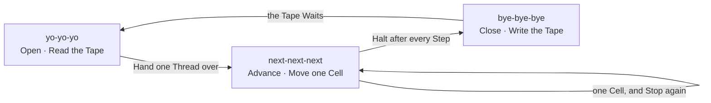

# The Lever and the Tape

- Three session skills Stand together:
  one Opens, one Advances, one Closes.
  Nobody Designed a machine; a machine appeared.

- The name is the Lever. A triple chant Pulls it,
  and the pull is Ritual — cheap, loud, and wanted.
- The handoff is the Tape. State Lives outside the head,
  so any session can read where the last one stopped.
- One step per invocation is the head Moving one cell.
  Read the Tape, Take the Step, Write the next Symbol, Halt.
- Each skill Names only the one that follows,
  so the three form a Ring and not a list.
  Walk it from any Node and you arrive where you started.
- A machine that takes two steps cannot be Stopped between them.
  The halt is what Makes the ritual safe to repeat.
- The chance is only in the Chant, never in the transition.
  A lever that surprises is a Slot Machine.
  A lever that resolves is a Groove.
