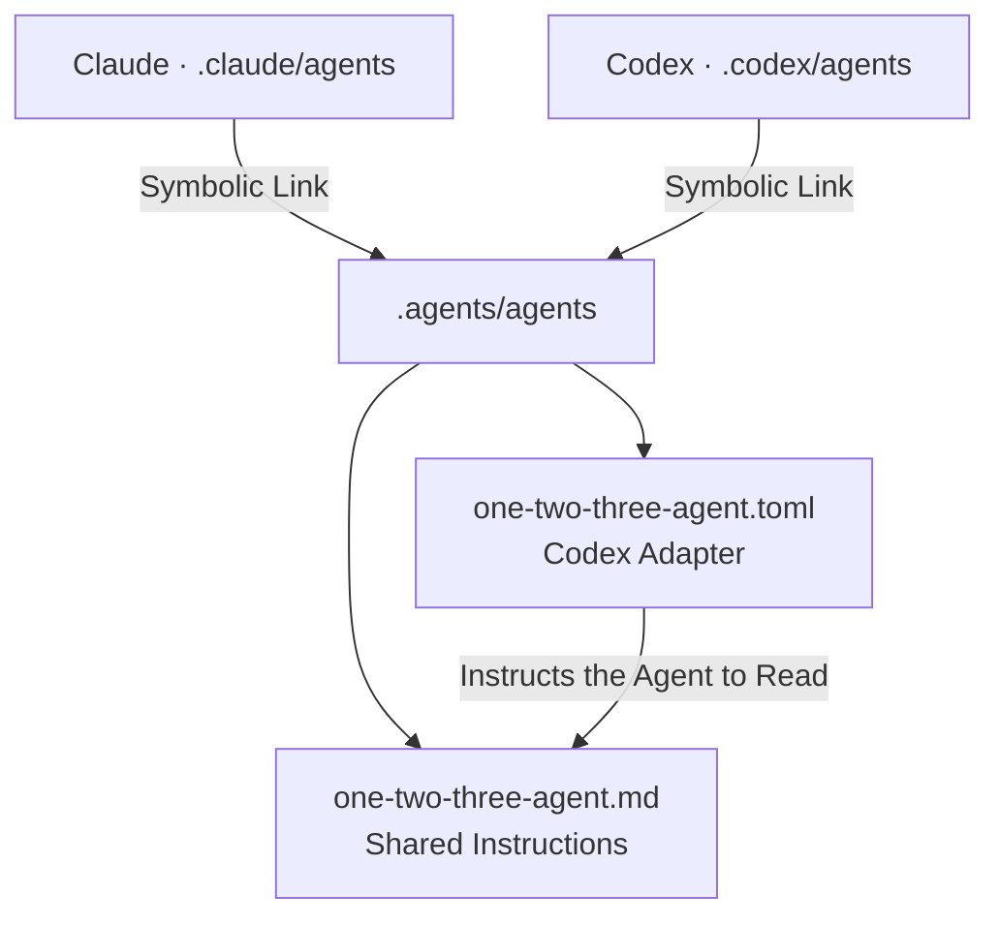

# Vendor Integration

- Keep shared Instructions in one canonical Source.
  Vendor Directories Must not Hold independent Copies.
- Expose that Source through relative Symbolic Links
  where the Tool Supports them.
- Add only the Metadata and Format Adapter each Vendor Requires.
  The Adapter Points to the Instructions; it never Repeats them.

## One Source, two Entrances

This Repository Keeps Agent Instructions in `.agents/agents/`.
Both Vendor Entrances Resolve to that Directory:

```text
.claude/agents -> ../.agents/agents
.codex/agents  -> ../.agents/agents
```

The shared Markdown Defines the Agent's Voice and Behavior.
The small TOML Adapter Identifies the Codex Agent
and Instructs it to Read that Markdown before it Talks.



A Link Shares Files; it does not Convert Formats.
The TOML Reference is an Instruction to the Agent,
not an automatic Markdown Import.

## Keep the Boundary small

- Edit shared Behavior in the canonical Source only.
  Vendor Adapters Hold Discovery Metadata and Loading Instructions.
- Link only the shared Subdirectory.
  Keep Vendor Settings and local Secrets outside it.
- Validate Link Targets and Adapter Syntax after a Change.
  Verify Discovery in the Target Tool before Claiming Runtime Support.

When a Tool Cannot Follow a Link or Read the shared Source,
Generate its required File from that Source.
Mark the Output as Generated; never Maintain a second Copy by Hand.

The File Integration Follows the same Boundary as
[Providers](providers.md): the shared Contract Owns the Meaning,
and the Vendor Addition only Adapts the Entrance.
